# Design Patterns

## Caratterizzazione dei Design Pattern

Un **Design Pattern** è una soluzione standard, ottimizzata e riutilizzabile a un problema ricorrente che si presenta durante la fase di progettazione del software, indipendente dallo specifico dominio applicativo. Non si tratta di codice preconfezionato pronto all’uso, bensì di una linea guida o di un modello concettuale che illustra come strutturare le entità per risolvere un problema in un determinato contesto. 

Rappresentano uno strumento fondamentale per l'ingegneria del software poiché forniscono architetture consolidate e collaudate, oltre a costituire un vocabolario tecnico comune che facilita la comunicazione all'interno del team di sviluppo. Ogni pattern identifica esplicitamente:
* Le classi e gli oggetti partecipanti;
* Le modalità di collaborazione e interazione tra di essi;
* La distribuzione ottimale delle responsabilità.

L'adozione dei design pattern deve essere valutata con criterio: se un problema di progettazione non coincide chiaramente con lo scenario d'uso di un determinato pattern, è buona norma non forzarne l'applicazione, al fine di evitare inutili sovrastrutture e un aumento ingiustificato della complessità del codice (*over-engineering*).

La descrizione e la documentazione dei design pattern si avvalgono dello standard UML (Unified Modeling Language), utilizzato per rappresentare graficamente le relazioni strutturali e i flussi dinamici tra i componenti. I pattern si suddividono ufficialmente in tre grandi macro-categorie:
* **Pattern Creazionali**: focalizzati sui meccanismi di istanziazione e creazione degli oggetti.
* **Pattern Strutturali**: dedicati alla composizione di classi e oggetti per formare strutture più grandi e flessibili.
* **Pattern Comportamentali**: incentrati sull'assegnazione delle responsabilità e sulle modalità di interazione e comunicazione tra gli oggetti.

L'obiettivo dei prossimi paragrafi sarà caratterizzare le principali famiglie di design pattern, descriverne la sintassi tramite diagrammi UML e analizzarne le peculiarità applicative.

## Design Pattern Creazionali

I **Design Pattern Creazionali** gestiscono i meccanismi di creazione degli oggetti, con l'obiettivo di rendere un sistema indipendente dalle modalità con cui le sue istanze vengono create, modellate e composte. Essi permettono di incapsulare la conoscenza sulle classi concrete utilizzate dal sistema, nascondendo i dettagli dell'istanziazione dietro interfacce astratte.

I design pattern creazionali più diffusi e utilizzati all'interno dell'ingegneria del software sono i seguenti (ordinati in modo crescente per complessità e flessibilità): 
* **Singleton Pattern**
* **Prototype Pattern**
* **Factory Method Pattern**
* **Abstract Factory Pattern**
* **Builder Pattern**

### Singleton Pattern

<figure class="fig-float right" style="width: 35%;">
  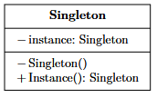
  <figcaption class="fig-caption">Singleton</figcaption>
</figure>

Il **Singleton** è un design pattern creazionale che assicura che una classe abbia una sola istanza all'interno del ciclo di vita dell'applicazione, fornendo al contempo un punto di accesso globale a tale istanza. Viene utilizzato principalmente quando è necessario garantire che una risorsa critica o un componente di controllo venga creato una sola volta durante l'esecuzione del programma, permettendo a tutti i moduli del sistema di accedervi in modo centralizzato e coerente.

All'interno di un diagramma UML, la struttura del pattern si sviluppa attraverso due componenti principali:
* **Singleton**: è la classe che incapsula la logica per garantire l'unicità dell'istanza. Al suo interno definisce un costruttore privato (per impedire l'uso dell'operatore `new` all'esterno), una variabile statica privata che memorizza l'unica istanza esistente e un metodo pubblico statico (solitamente denominato `getInstance()`) deputato a restituire l'istanza al mittente, occupandosi anche della sua eventuale inizializzazione.
* **Client**: rappresenta qualsiasi oggetto o componente del sistema che usufruisce dei servizi della classe Singleton, accedendo ai suoi metodi d'istanza esclusivamente tramite il varco offerto dal metodo `getInstance()`.

I vantaggi di questo pattern è che previene con certezza copie di una risorsa condivisa e inoltre fornisce un punto di accesso globale utilizzabile ovunque nel codice. Presenta però anche degli importanti svantaggi a cui prestare attenzione. Il primo è il **forte accoppiamento**: le classi che impiegano il Singleton dipendono strettamente dalla sua implementazione specifica, rendendo il codice rigido e difficile da modificare. In secondo luogo, si riscontra una notevole **difficoltà nei test unitari**: la natura globale del Singleton impedisce un corretto isolamento dei test, poiché lo stato della risorsa si trascina tra le diverse esecuzioni producendo effetti collaterali e risultati poco prevedibili. Infine, un aspetto critico riguarda la **thread safety**: nelle applicazioni multithread, se il meccanismo di allocazione non è adeguatamente sincronizzato tramite primitive di mutua esclusione, si possono verificare fenomeni di *race condition* in grado di generare istanze multiple sovrapposte, violando il principio cardine del pattern stesso.

<figure class="fig-float center" style="width: 80%;">
  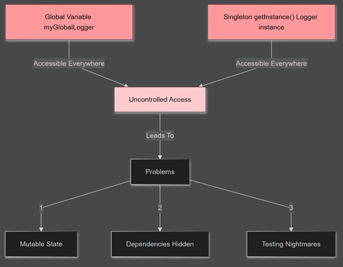
  <figcaption class="fig-caption">Criticità del pattern Singleton</figcaption>
</figure>

Per queste ragioni, nell'ingegneria del software moderna si raccomanda di limitare l'uso del Singleton a scenari molto circoscritti e specifici. Tra le applicazioni ideali rientrano i registri di configurazione immutabili in sola lettura, i componenti infrastrutturali puri come i gestori dei pool di connessioni ai database oppure, come si può osservare dalla seguente figura, uno degli utilizzi più gettonati per realizzare sistemi di logging centralizzati.

<figure class="fig-float center" style="width: 80%;">
  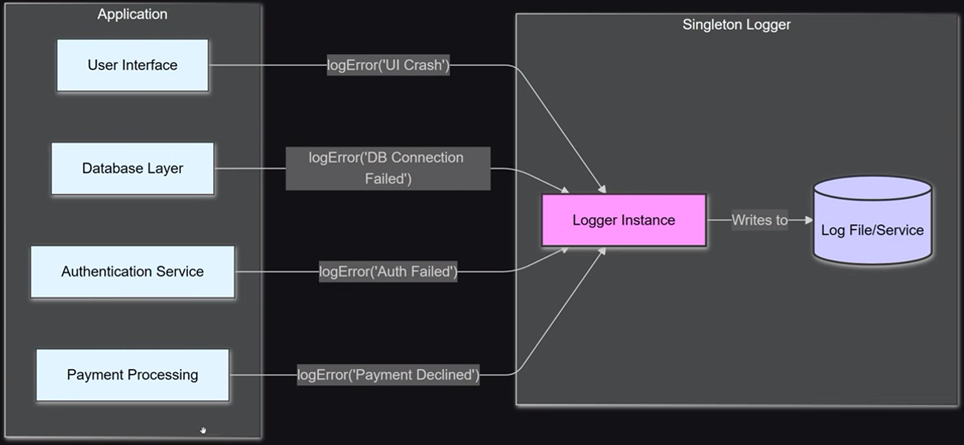
  <figcaption class="fig-caption">Esempio applicativo del pattern Singleton</figcaption>
</figure>

```c++
#include <iostream>
#include <string>
#include <mutex>

/**
 * @brief La classe Logger implementa il pattern Singleton (Meyers' Singleton).
 * Fornisce un sistema di logging centralizzato e thread-safe all'interno dell'applicazione.
 */
class Logger {
private:
    // 1. Costruttore privato: impedisce l'istanziazione diretta dall'esterno dell'oggetto.
    Logger() {
        std::cout << "[Logger] Istanza creata e inizializzata correttamente.\n";
    }

    // Contatore interno per simulare lo stato del Singleton
    int logCount = 0;

public:
    // 2. Eliminazione del costruttore di copia e dell'operatore di assegnamento.
    // Questo garantisce l'impossibilità di clonare o copiare l'istanza unica.
    Logger(const Logger&) = delete;
    Logger& operator=(const Logger&) = delete;

    // 3. Metodo statico pubblico per ottenere l'accesso globale all'istanza unica.
    static Logger& getInstance() {
        // C++11 garantisce che l'inizializzazione di variabili statiche locali 
        // sia thread-safe (Magic Statics). Non serve un blocco di mutex manuale.
        static Logger instance;
        return instance;
    }

    /**
     * @brief Metodo di istanza per registrare un messaggio nel log.
     * @param message Il testo da stampare a schermo.
     */
    void log(const std::string& message) {
        logCount++;
        std::cout << "[LOG #" << logCount << "]: " << message << std::endl;
    }
};

/**
 * @brief Componente Client che simula l'interazione con il Singleton.
 */
int main() {
    std::cout << "--- Inizio esecuzione del programma Client ---\n\n";

    // Tentativi di istanziazione illegali (generano errori a tempo di compilazione):
    // Logger l1;                  // ERRORE: Costruttore privato
    // Logger l2 = Logger::getInstance(); // ERRORE: Costruttore di copia eliminato

    std::cout << "Richiesta del Logger per la prima operazione...\n";
    // Primo accesso: viene invocato il costruttore privato e creata l'istanza statica
    Logger::getInstance().log("Avvio del modulo di calcolo architetturale.");

    std::cout << "\nRichiesta del Logger per la seconda operazione da un altro punto del sistema...\n";
    // Accessi successivi: viene restituito un riferimento alla stessa identica istanza
    Logger& mioLogger = Logger::getInstance();
    mioLogger.log("Connessione al database stabilita con successo.");
    mioLogger.log("Operazione di scrittura completata.");

    std::cout << "\n--- Fine esecuzione del programma Client ---\n";
    return 0;
}
```

### Prototype Pattern

Il **Prototype Pattern** è un design pattern creazionale che consente di creare nuovi oggetti copiando o clonando un’istanza già esistente, definita prototipo, anziché istanziarla da zero tramite l'invocazione diretta dei costruttori. Questa soluzione si rivela particolarmente utile quando il processo di inizializzazione di un oggetto risulta eccessivamente oneroso in termini di tempo di calcolo, consumo di risorse o configurazione dei parametri, oppure quando il sistema deve produrre rapidamente numerose istanze indipendenti che condividono gran parte dello stato iniziale.

Dal punto di vista strutturale, il pattern organizza le interazioni tra tre componenti logici:
* **Prototype**: è l’interfaccia o la classe astratta che dichiara il metodo standard di clonazione (comunemente denominato `clone()`), stabilendo un contratto uniforme per tutte le entità che fungono da modello.
* **ConcretePrototype**: rappresenta la classe concreta che implementa l'interfaccia di clonazione e definisce l'algoritmo specifico per duplicare il proprio stato interno, gestendo le operazioni necessarie a restituire una copia esatta di se stessa.
* **Client**: è il modulo che coordina la creazione dei nuovi oggetti richiamando il metodo di clonazione direttamente sulle istanze prototipo a sua disposizione, operando in modo astratto senza dover conoscere i dettagli implementativi delle classi concrete.

<figure class="fig-float center" style="width: 60%;">
  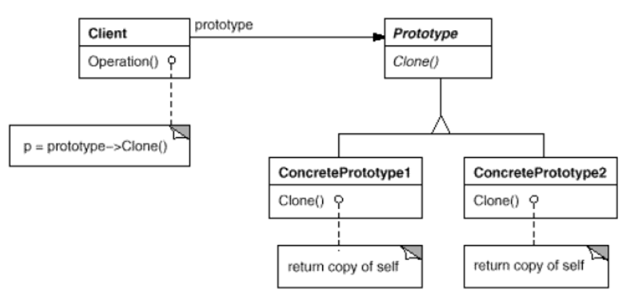
  <figcaption class="fig-caption">Prototype</figcaption>
</figure>

Tra i vantaggi più significativi di questo schema architetturale spicca la drastica riduzione dei costi associati alla creazione di oggetti complessi, in quanto permette di scavalcare lunghe routine di inizializzazione o ripetitive query ai database. Inoltre, riduce sensibilmente l'accoppiamento isolando il client dalle sottoclassi concrete e offre una flessibilità notevole qualora si debbano gestire gerarchie di classi complesse con configurazioni dinamiche definite a runtime.

Di contro, il Prototype presenta alcuni svantaggi di rilievo legati principalmente alla complessità della clonazione. Quando si opera con oggetti caratterizzati da relazioni profondamente annidate, strutture ricorsive o riferimenti circolari, l'implementazione del metodo di copia diventa complessa e incline a errori. In questi scenari è fondamentale distinguere e gestire accuratamente la differenza tra copia superficiale (*Shallow Copy*) e copia profonda (*Deep Copy*), per evitare che le modifiche apportate al nuovo oggetto clonato si ripercuotano inavvertitamente sullo stato del prototipo originale, generando insidiosi bug a runtime.

```c++
#include <iostream>
#include <string>
#include <memory>

/**
 * @brief Componente accessorio per dimostrare la Deep Copy (Copia Profonda).
 * Rappresenta una risorsa complessa allocata sulla heap dall'oggetto originale.
 */
class ConfigurazioneHardware {
public:
    std::string dettagli;
    ConfigurazioneHardware(const std::string& d) : dettagli(d) {}
};

/**
 * @brief Componente PROTOTYPE
 * Interfaccia astratta che definisce il metodo standard di clonazione.
 */
class SensoreIotPrototype {
public:
    virtual ~SensoreIotPrototype() = default;
    
    // Metodo puro di clonazione (Restituisce uno smart pointer al clone)
    virtual std::unique_ptr<SensoreIotPrototype> clone() const = 0;
    
    // Metodo per visualizzare le informazioni correnti dell'oggetto
    virtual void stampaStato() const = 0;
    virtual void impostaId(int id) = 0;
};

/**
 * @brief Componente CONCRETEPROTOTYPE
 * Implementa l'interfaccia di clonazione effettuando una Deep Copy del proprio stato.
 */
class SensoreTemperatura : public SensoreIotPrototype {
private:
    int idSensore;
    std::string firmwareVersione;
    // Puntatore a una risorsa allocata dinamicamente sulla heap
    std::unique_ptr<ConfigurazioneHardware> configurazione;

public:
    // Costruttore oneroso (simula un'inizializzazione complessa)
    SensoreTemperatura(int id, const std::string& fw, const std::string& confDettagli)
        : idSensore(id), firmwareVersione(fw) {
        std::cout << "[Sensore #" << idSensore << "] Inizializzazione onerosa (caricamento firmware e calibrazione hardware)...\n";
        configurazione = std::make_unique<ConfigurazioneHardware>(confDettagli);
    }

    // Costruttore di copia privato, sfruttato internamente dal metodo clone() per la Deep Copy
    SensoreTemperatura(const SensoreTemperatura& altro)
        : idSensore(altro.idSensore), firmwareVersione(altro.firmwareVersione) {
        // EFFETTUIAMO UNA DEEP COPY: allochiamo una nuova porzione di memoria 
        // sulla heap copiando il CONTENUTO dell'oggetto originale.
        if (altro.configurazione) {
            configurazione = std::make_unique<ConfigurazioneHardware>(altro.configurazione->dettagli);
        }
    }

    // Implementazione del metodo clone()
    std::unique_ptr<SensoreIotPrototype> clone() const override {
        // Invocando il costruttore di copia profonda, creiamo un'istanza duplicata indipendente
        return std::make_unique<SensoreTemperatura>(*this);
    }

    void impostaId(int id) override {
        idSensore = id;
    }

    void stampaStato() const override {
        std::cout << "-> Sensore ID: " << idSensore 
                  << " | FW: " << firmwareVersione 
                  << " | Hardware: " << (configurazione ? configurazione->dettagli : "Nessuno") 
                  << " [Indirizzo Config: " << configurazione.get() << "]\n";
    }
};

/**
 * @brief Componente CLIENT
 * Utilizza il prototipo per generare rapidamente istanze pre-configurate.
 */
int main() {
    std::cout << "--- Inizio esecuzione del programma Client (Prototype Pattern) ---\n\n";

    std::cout << "1. Creazione dell'oggetto Prototipo (Inizializzazione Master)...\n";
    // Creiamo il prototipo di riferimento. Questa è l'unica operazione "costosa" in termini di calcolo.
    std::unique_ptr<SensoreIotPrototype> prototipoMaster = 
        std::make_unique<SensoreTemperatura>(100, "v2.4.1", "Calibrazione_Standard_Zona_A");
    
    std::cout << "\nStato del prototipo master:\n";
    prototipoMaster->stampaStato();

    std::cout << "\n2. Clonazione rapida dei sensori dal Prototipo (Scavalcando i costruttori onerosi)...\n";
    
    // Generiamo il primo sensore clonando il master
    std::unique_ptr<SensoreIotPrototype> sensoreClonato1 = prototipoMaster->clone();
    sensoreClonato1->impostaId(101); // Modifichiamo lo stato specifico senza intaccare il master

    // Generiamo il secondo sensore clonando il master
    std::unique_ptr<SensoreIotPrototype> sensoreClonato2 = prototipoMaster->clone();
    sensoreClonato2->impostaId(102);

    std::cout << "\n3. Verifica dello stato dei cloni e degli indirizzi di memoria:\n";
    sensoreClonato1->stampaStato();
    sensoreClonato2->stampaStato();
    prototipoMaster->stampaStato(); // Il master è rimasto invariato

    std::cout << "\nNota: gli indirizzi 'Config' tra parentesi quadre sono diversi. La Deep Copy ha funzionato!\n";
    std::cout << "\n--- Fine esecuzione del programma Client ---\n";
    return 0;
}
```

### Factory Method Pattern

Il **Factory Method Pattern** è un pattern creazionale che fornisce un'interfaccia per la creazione di oggetti, delegando alle sottoclassi la responsabilità di decidere quale specifica classe concreta istanziare. In altre parole, una superclasse definisce le regole generali di comportamento e rimanda l'effettivo compito di istanziazione ai livelli gerarchici inferiori, evitando di esplicitare nel proprio codice le classi concrete dei prodotti. Questa soluzione consente di strutturare i sistemi in modo altamente flessibile, permettendo all'applicazione di adattare il tipo di oggetto generato in base allo specifico contesto d'uso.

<figure class="fig-float center" style="width: 75%;">
  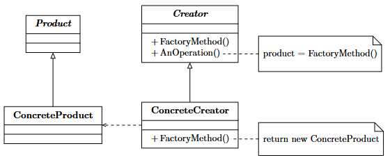
  <figcaption class="fig-caption">Struttura delle classi nel Factory Method Pattern</figcaption>
</figure>

La struttura del diagramma UML per questo pattern si articola attorno a quattro componenti principali:
* **Product**: è l'interfaccia o la classe astratta che stabilisce il contratto e le specifiche comuni per tutti i prodotti che il metodo di fabbricazione può generare.
* **ConcreteProduct**: rappresenta la classe concreta che implementa l'interfaccia o estende la classe astratta *Product*, definendone l'effettivo comportamento di business.
* **Creator**: è la classe astratta che dichiara il *factory method* (il metodo di fabbricazione). Spesso contiene anche logiche di core business che operano sui prodotti astratti, lasciando l'inizializzazione alle sottoclassi.
* **ConcreteCreator**: è la sottoclasse concreta che eredita da *Creator* e ridefinisce il *factory method* per restituire una specifica istanza di *ConcreteProduct*.

Tra i principali vantaggi di questo schema architetturale spicca la capacità di creare oggetti senza dover legare il codice applicativo alle classi concrete, riducendo l'accoppiamento e migliorando sensibilmente l'estensibilità del sistema. Inoltre, favorisce una gestione centralizzata e pulita della creazione degli oggetti, che può essere alterata o estesa introducendo nuove sottoclassi senza dover modificare in alcun modo il codice del client. Di contro, l'introduzione del Factory Method comporta un aumento della complessità strutturale del software, poiché richiede lo sviluppo di numerose classi di supporto (i vari creatori e le loro specializzazioni). Questo può portare a una logica di istanziamento più frammentata e distribuita tra i diversi nodi della gerarchia.

Consideriamo di avere un'app in cui definiamo una serie di utenti diversi. Il risultato di tale sviluppo sarà probabilmente qualcosa di questo tipo, una serie di if-else per considerare i diversi casi.

<figure class="fig-float center" style="width: 75%;">
  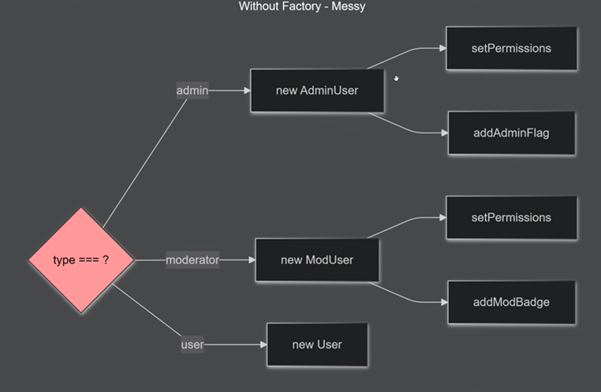
  <figcaption class="fig-caption">Esempio creazione utenti senza l'utilizzo del factory pattern.</figcaption>
</figure>

Con il factory pattern invece, realizziamo un metodo di create a cui passiamo i parametri e tutta la complessità di costruzione viene nascosta dentro la classe.

<figure class="fig-float center" style="width: 75%;">
  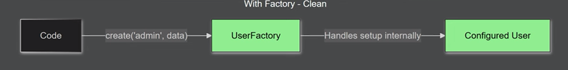
  <figcaption class="fig-caption">Esempio creazione utenti con l'utilizzo del factory pattern.</figcaption>
</figure>

```c++
#include <iostream>
#include <string>
#include <memory>

/**
 * @brief Componente PRODUCT
 * Interfaccia astratta che definisce il contratto comune per tutti gli utenti del sistema.
 */
class Utente {
public:
    virtual ~Utente() = default; // Distruttore virtuale fondamentale per il polimorfismo
    virtual void mostraPrivilegi() const = 0;
};

/**
 * @brief Componente CONCRETEPRODUCT A
 * Implementazione specifica per l'utente di tipo Amministratore.
 */
class UtenteAdmin : public Utente {
public:
    void mostraPrivilegi() const override {
        std::cout << "[Utente: Admin] -> Accesso completo al database, gestione permessi e configurazione di sistema.\n";
    }
};

/**
 * @brief Componente CONCRETEPRODUCT B
 * Implementazione specifica per l'utente di tipo Cliente standard.
 */
class UtenteCustomer : public Utente {
public:
    void mostraPrivilegi() const override {
        std::cout << "[Utente: Customer] -> Accesso in sola lettura al catalogo prodotti ed esecuzione acquisti.\n";
    }
};

/**
 * @brief Componente CREATOR
 * Classe astratta che dichiara il Factory Method (metodo di fabbricazione).
 */
class GestoreUtenti {
public:
    virtual ~GestoreUtenti() = default;

    // Il Factory Method puro: delega l'istanziamento alle sottoclassi
    virtual std::unique_ptr<Utente> creaUtente() const = 0;

    /**
     * @brief Operazione di core business.
     * Dimostra come la superclasse possa operare sul prodotto astratto 
     * senza conoscere la sua implementazione concreta.
     */
    void inizializzaProfilo() const {
        // Chiamata al Factory Method per ottenere il prodotto astratto
        std::unique_ptr<Utente> utente = creaUtente();
        std::cout << "[Gestore] Avvio della procedura di inizializzazione profilo...\n";
        utente->mostraPrivilegi(); // Comportamento polimorfico
    }
};

/**
 * @brief Componente CONCRETECREATOR A
 * Fabbrica specifica per la generazione di utenti Amministratori.
 */
class CreatoreAdmin : public GestoreUtenti {
public:
    std::unique_ptr<Utente> creaUtente() const override {
        // Ritorna l'istanza concreta incapsulata in uno smart pointer
        return std::make_unique<UtenteAdmin>();
    }
};

/**
 * @brief Componente CONCRETECREATOR B
 * Fabbrica specifica per la generazione di utenti Clienti standard.
 */
class CreatoreCustomer : public GestoreUtenti {
public:
    std::unique_ptr<Utente> creaUtente() const override {
        return std::make_unique<UtenteCustomer>();
    }
};

/**
 * @brief Componente CLIENT
 * Utilizza le fabbriche per generare gli oggetti in modo astratto, 
 * eliminando blocchi di if-else hardcoded.
 */
int main() {
    std::cout << "--- Inizio esecuzione del programma Client (Factory Method Pattern) ---\n\n";

    // 1. Il client decide quale creatore utilizzare (es. configurato a runtime o da file)
    std::unique_ptr<GestoreUtenti> gestore;

    std::cout << "Scenario A: Il sistema richiede la creazione di un Amministratore.\n";
    gestore = std::make_unique<CreatoreAdmin>();
    // Il client invoca l'operazione senza sapere quale classe concreta verrà istanziata internamente
    gestore->inizializzaProfilo(); 

    std::cout << "\nScenario B: Il sistema richiede la creazione di un Cliente standard.\n";
    gestore = std::make_unique<CreatoreCustomer>();
    // Stessa identica chiamata, ma comportamento differente (polimorfismo)
    gestore->inizializzaProfilo();

    std::cout << "\n--- Fine esecuzione del programma Client ---\n";
    return 0;
}
```

---

### Abstract Factory Pattern

L'**Abstract Factory Pattern** è un design pattern creazionale focalizzato sulla fornitura di un'interfaccia centralizzata per la creazione di intere famiglie di oggetti correlati o dipendenti tra loro, senza la necessità di specificare o conoscere le loro classi concrete. Rappresenta un livello di astrazione superiore rispetto al Factory Method: mentre quest'ultimo è focalizzato sulla creazione di un singolo tipo di prodotto isolato, l'Abstract Factory coordina la generazione coordinata di molteplici componenti strutturalmente interconnessi.

<figure class="fig-float center" style="width: 80%;">
  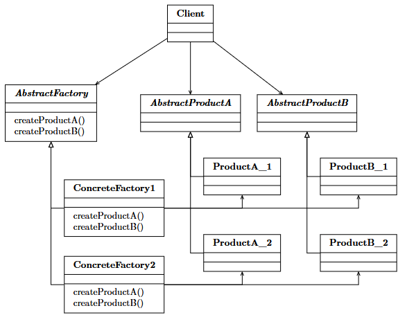
  <figcaption class="fig-caption">Architettura delle classi nell'Abstract Factory Pattern</figcaption>
</figure>

All'interno di una modellazione UML, l'interazione tra i moduli viene definita attraverso i seguenti elementi costitutivi:
* **AbstractFactory**: è l'interfaccia o la classe astratta che dichiara l'insieme dei metodi dedicati alla creazione di ciascun prodotto base appartenente alla famiglia di oggetti.
* **ConcreteFactory**: rappresenta la classe concreta che implementa le operazioni definite in *AbstractFactory*, occupandosi di istanziare i prodotti specifici associati a una determinata variante o sotto-famiglia.
* **AbstractProduct**: individua le interfacce o le classi astratte distinte che definiscono le caratteristiche comuni a ciascuna tipologia di prodotto indipendente all'interno della famiglia.
* **ConcreteProduct**: sono le implementazioni concrete che danno corpo ai rispettivi *AbstractProduct*, raggruppate logicamente in base alla fabbrica di appartenenza per garantirne la piena compatibilità reciproca.
* **Client**: è il modulo o l'oggetto che interagisce esclusivamente attraverso i contratti esposti da *AbstractFactory* e *AbstractProduct*, operando in totale isolamento dai dettagli implementativi concreti delle fabbriche.

I vantaggi principali dell'Abstract Factory risiedono nella capacità di garantire la coerenza assoluta tra gli oggetti generati, impedendo al client di mescolare accidentalmente prodotti appartenenti a famiglie non compatibili. Sostiene attivamente il principio di inversione delle dipendenze e isola le responsabilità applicative dal framework sottostante, mantenendo il sistema scalabile ed estensibile. Tuttavia, lo svantaggio principale si riscontra nella rigidità strutturale che introduce qualora si debba estendere la famiglia stessa: l'aggiunta di un nuovo tipo di prodotto richiede infatti la modifica obbligatoria dell'interfaccia *AbstractFactory* e la conseguente riscrittura di tutte le classi *ConcreteFactory* collegate. Inoltre, analogamente ad altri pattern creazionali complessi, comporta una proliferazione del numero di classi e può limitare la flessibilità se sorge la necessità di combinare liberamente oggetti provenienti da famiglie differenti.

Un esempio classico e altamente intuitivo di questo approccio è rappresentato dallo sviluppo di interfacce grafiche multi-piattaforma. Ogni sistema operativo (come Windows, macOS o Linux) definisce una propria famiglia coerente di componenti visivi (pulsanti, barre di scorrimento, finestre). L'applicazione, per rimanere portabile, delega a una specifica fabbrica concreta il compito di generare la corretta suite di elementi grafici in base al sistema operativo su cui è attualmente in esecuzione, senza che la logica di business debba minimamente preoccuparsi di quale sia l'ambiente software sottostante.

```c++
#include <iostream>
#include <string>
#include <memory>

// ==========================================
// 1. COMPONENTI ABSTRACT PRODUCT & CONCRETE PRODUCT
// ==========================================

/**
 * @brief Famiglia di Prodotti A - Interfaccia Astratta "Pulsante"
 */
class Button {
public:
    virtual ~Button() = default;
    virtual void paint() const = 0;
};

/**
 * @brief Prodotto Concreto A1 - Pulsante in stile Windows
 */
class WindowsButton : public Button {
public:
    void paint() const override {
        std::cout << "[Windows] Rendering di un pulsante rettangolare grigio classico.\n";
    }
};

/**
 * @brief Prodotto Concreto A2 - Pulsante in stile macOS
 */
class MacButton : public Button {
public:
    void paint() const override {
        std::cout << "[macOS] Rendering di un pulsante arrotondato con effetto sfumato.\n";
    }
};

/**
 * @brief Famiglia di Prodotti B - Interfaccia Astratta "Casella di Spunta"
 */
class Checkbox {
public:
    virtual ~Checkbox() = default;
    virtual void paint() const = 0;
};

/**
 * @brief Prodotto Concreto B1 - Casella di spunta in stile Windows
 */
class WindowsCheckbox : public Checkbox {
public:
    void paint() const override {
        std::cout << "[Windows] Rendering di una casella di spunta quadrata.\n";
    }
};

/**
 * @brief Prodotto Concreto B2 - Casella di spunta in stile macOS
 */
class MacCheckbox : public Checkbox {
public:
    void paint() const override {
        std::cout << "[macOS] Rendering di una casella di spunta blu con segno di spunta animato.\n";
    }
};


// ==========================================
// 2. COMPONENTI ABSTRACT FACTORY & CONCRETE FACTORY
// ==========================================

/**
 * @brief Componente ABSTRACTFACTORY
 * Dichiarazione dei metodi di fabbricazione per l'intera famiglia di prodotti.
 */
class GUIFactory {
public:
    virtual ~GUIFactory() = default;
    
    // Metodi per generare ciascun prodotto base della famiglia
    virtual std::unique_ptr<Button> createButton() const = 0;
    virtual std::unique_ptr<Checkbox> createCheckbox() const = 0;
};

/**
 * @brief Componente CONCRETEFACTORY 1
 * Implementazione della fabbrica dedicata alla suite grafica Windows.
 */
class WindowsFactory : public GUIFactory {
public:
    std::unique_ptr<Button> createButton() const override {
        return std::make_unique<WindowsButton>();
    }
    std::unique_ptr<Checkbox> createCheckbox() const override {
        return std::make_unique<WindowsCheckbox>();
    }
};

/**
 * @brief Componente CONCRETEFACTORY 2
 * Implementazione della fabbrica dedicata alla suite grafica macOS.
 */
class MacFactory : public GUIFactory {
public:
    std::unique_ptr<Button> createButton() const override {
        return std::make_unique<MacButton>();
    }
    std::unique_ptr<Checkbox> createCheckbox() const override {
        return std::make_unique<MacCheckbox>();
    }
};


// ==========================================
// 3. COMPONENTE CLIENT
// ==========================================

/**
 * @brief L'applicazione Client interagisce unicamente tramite le astrazioni,
 * garantendo la coerenza visiva dei componenti ed escludendo accoppiamenti rigidi.
 */
class Application {
private:
    std::unique_ptr<Button> button;
    std::unique_ptr<Checkbox> checkbox;

public:
    // Il costruttore accetta la fabbrica astratta (Dependency Injection)
    Application(const GUIFactory& factory) {
        // La fabbrica garantisce che button e checkbox appartengano alla stessa identica famiglia
        button = factory.createButton();
        checkbox = factory.createCheckbox();
    }

    void renderizzaInterfaccia() const {
        std::cout << "[Client App] Avvio rendering dei componenti grafici...\n";
        button->paint();
        checkbox->paint();
    }
};

/**
 * @brief Configurazione dell'ambiente a runtime.
 */
int main() {
    std::cout << "--- Inizio esecuzione del programma Client (Abstract Factory) ---\n\n";

    std::unique_ptr<GUIFactory> factory;
    
    // Simuliamo la rilevazione del Sistema Operativo corrente a runtime
    std::string sistemaOperativo = "macOS"; // Può essere letto da file o variabili d'ambiente

    std::cout << "[Sistema] Rilevato ambiente operativo: " << sistemaOperativo << "\n\n";

    if (sistemaOperativo == "Windows") {
        factory = std::make_unique<WindowsFactory>();
    } else if (sistemaOperativo == "macOS") {
        factory = std::make_unique<MacFactory>();
    }

    // Passiamo la fabbrica concreta all'applicazione cliente
    Application app(*factory);
    app.renderizzaInterfaccia();

    std::cout << "\n--- Fine esecuzione del programma Client ---\n";
    return 0;
}
```

### Builder Pattern
Il **Builder Pattern** è un design pattern creazionale utilizzato quando la creazione di un oggetto è complessa, prevede numerosi parametri (molti dei quali opzionali) o richiede una configurazione passo dopo passo. 

Invece di costringere il client a utilizzare un costruttore gigantesco (il cosiddetto *telescoping constructor*), il Builder separa il processo di costruzione dalla rappresentazione finale dell'oggetto.

* **Product**: L'oggetto complesso che si desidera creare.
* **Builder**: L'interfaccia astratta (o classe) che definisce tutti i passi necessari per creare le varie parti del *Product*.
* **ConcreteBuilder**: L'implementazione specifica del Builder che tiene traccia dello stato della costruzione e assembla il prodotto finale.
* **Director**: La classe che controlla l'ordine e la sequenza dei passi di costruzione. Riceve un Builder e lo guida per generare una configurazione specifica di un prodotto.

<div style="text-align: center; margin: 24px 0;">
  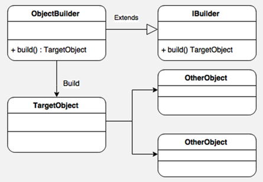
  <div class="fig-caption">Struttura delle classi nel pattern Builder</div>
</div>

I vantaggi del Builder Pattern sono certamente l'isolamento del codice visto che separa il codice di costruzione di un oggetto complesso dalla sua logica di business e consente inoltre un controllo granulare circa la sua creazione. Gli oggetti costruiti risultano essere immutabili poichè i valori vengono accumulati nel Builder prima di istanziare il prodotto finale. Grazie a ciò vige il principio della Single Responsibility visto che la logica di inizializzazione complessa è fuori dalle classi principali del dominio.

Tuttavia, presenta svantaggi come l'avere un codice boilerplate, ovvero che richiede la creazione di molte nuove classi (il Builder, le interfacce, l'eventuale Director), aumentando la complessità iniziale del progetto. Ultimo svantaggio è il fattore accoppiamento, il Builder concreto infatti è strettamente legato al prodotto specifico; se il prodotto cambia drasticamente, il Builder deve essere aggiornato di conseguenza.

Nel mondo reale (come in Java), spesso si usa una variante del pattern senza il *Director*, implementando un **Fluent Builder** direttamente come classe interna statica per rendere il codice del client estremamente leggibile.

```c++
#include <iostream>
#include <string>
#include <memory>

/**
 * @brief Componente PRODUCT
 * L'oggetto complesso che si desidera creare. In questo scenario, le componenti 
 * possono variare drasticamente (es. RAM opzionale, GPU dedicata opzionale).
 */
class Computer {
private:
    // Attributi del prodotto
    std::string CPU;
    std::string RAM;
    std::string GPU;
    std::string storage;

    // Il costruttore è privato: nessuno può istanziare un Computer direttamente 
    // dall'esterno senza passare attraverso il Builder.
    Computer() = default;

    // Rendiamo il Builder "friend" per concedergli l'accesso ai membri privati
    friend class ComputerBuilder;

public:
    void mostraSpecifiche() const {
        std::cout << "[Computer Specifiche]:\n"
                  << " -> CPU: " << CPU << "\n"
                  << " -> RAM: " << (RAM.empty() ? "Non installata" : RAM) << "\n"
                  << " -> GPU: " << (GPU.empty() ? "Grafica Integrata" : GPU) << "\n"
                  << " -> Storage: " << storage << "\n";
    }
};

/**
 * @brief Componente CONCRETEBUILDER (in modalità Fluent)
 * Gestisce l'accumulo dei parametri e assembla passo dopo passo l'oggetto finale.
 */
class ComputerBuilder {
private:
    // L'istanza in fase di costruzione viene allocata sulla heap
    std::unique_ptr<Computer> computerInCostruzione;

public:
    ComputerBuilder() {
        // Avvia il processo di accumulo dello stato
        computerInCostruzione = std::unique_ptr<Computer>(new Computer());
    }

    // Passo 1: Configurazione CPU (restituisce il riferimento a se stesso per il chaining)
    ComputerBuilder& aggiungiCPU(const std::string& cpuModello) {
        computerInCostruzione->CPU = cpuModello;
        return *this;
    }

    // Passo 2 (Opzionale): Configurazione RAM
    ComputerBuilder& aggiungiRAM(const std::string& ramModello) {
        computerInCostruzione->RAM = ramModello;
        return *this;
    }

    // Passo 3 (Opzionale): Configurazione GPU dedicata
    ComputerBuilder& aggiungiGPU(const std::string& gpuModello) {
        computerInCostruzione->GPU = gpuModello;
        return *this;
    }

    // Passo 4: Configurazione Storage
    ComputerBuilder& aggiungiStorage(const std::string& storageModello) {
        computerInCostruzione->storage = storageModello;
        return *this;
    }

    /**
     * @brief Metodo di finalizzazione (Metodo Build)
     * Trasferisce la proprietà esclusiva del prodotto finito al client.
     */
    std::unique_ptr<Computer> build() {
        // Spostiamo la proprietà dello smart pointer fuori dal builder
        return std::move(computerInCostruzione);
    }
};

/**
 * @brief Componente CLIENT
 * Dimostra la leggibilità del Fluent Builder ed esclude il telescoping constructor.
 */
int main() {
    std::cout << "--- Inizio esecuzione del programma Client (Builder Pattern) ---\n\n";

    std::cout << "1. Configurazione e assemblaggio di un Computer da Gaming (Configurazione Completa):\n";
    
    // Sfruttiamo il Method Chaining (Interfaccia Fluida)
    std::unique_ptr<Computer> pcGaming = ComputerBuilder()
                                            .aggiungiCPU("Intel Core i9-14900K")
                                            .aggiungiRAM("32GB DDR5 Corsair")
                                            .aggiungiGPU("NVIDIA RTX 4090")
                                            .aggiungiStorage("2TB NVMe M.2 SSD")
                                            .build();

    pcGaming->mostraSpecifiche();

    std::cout << "\n2. Configurazione e assemblaggio di un PC da Ufficio (Configurazione Minimalista):\n";
    
    // Notare come i passi opzionali (RAM aggiuntiva o GPU dedicata) vengano semplicemente saltati
    std::unique_ptr<Computer> pcUfficio = ComputerBuilder()
                                             .aggiungiCPU("Intel Core i3")
                                             .aggiungiStorage("500GB HDD")
                                             .build();

    pcUfficio->mostraSpecifiche();

    std::cout << "\n--- Fine esecuzione del programma Client ---\n";
    return 0;
}
```

## Design Pattern Strutturali

I **Design Pattern Strutturali** definiscono le modalità con cui le classi e gli oggetti vengono combinati per comporre strutture più grandi, complesse e flessibili. Mentre l'ereditarietà classica viene utilizzata per legare interfacce o implementazioni in modo statico a tempo di compilazione, i pattern strutturali sfruttano principalmente la composizione di oggetti a runtime per creare architetture disaccoppiate e facilmente manutenibili.

I design pattern strutturali più diffusi nell'ingegneria del software sono i seguenti (ordinati per livello di complessità e astrazione):
* **Adapter Pattern**: converte l'interfaccia di una classe in un'altra interfaccia attesa dai client, consentendo la collaborazione tra moduli nativamente incompatibili.
* **Facade Pattern**: fornisce un'interfaccia unificata e semplificata verso un sottosistema complesso, nascondendone i dettagli implementativi per migliorarne l'usabilità.
* **Composite Pattern**: organizza gli oggetti in strutture ad albero per rappresentare gerarchie parte-tutto, permettendo ai client di trattare singoli elementi e composizioni di oggetti in modo uniforme.
* **Decorator Pattern**: consente di aggiungere dinamicamente funzionalità e responsabilità a un oggetto senza modificarne la struttura originale, sfruttando la composizione in alternativa all'ereditarietà.
* **Flyweight Pattern**: riduce l'uso della memoria e ottimizza le prestazioni condividendo lo stato comune tra un numero elevato di oggetti simili di piccole dimensioni.
* **Proxy Pattern**: introduce un oggetto intermediario o surrogato che agisce al posto dell'oggetto reale per controllarne l'accesso, implementando logiche di ottimizzazione o sicurezza.

---

### Adapter Pattern

<figure class="fig-float center" style="width: 70%;">
  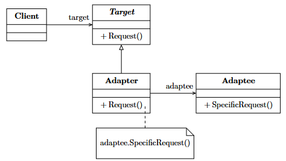
  <figcaption class="fig-caption">Struttura delle classi nell'Adapter Pattern</figcaption>
</figure>

L'**Adapter Pattern** (noto anche come *Wrapper*) è una soluzione strutturale concepita per convertire l'interfaccia di una classe esistente in un'interfaccia differente richiesta dal client. Agendo come un vero e proprio traduttore, l'Adapter colma il divario tra due API incompatibili senza alterare minimamente il codice sorgente originario di nessuna delle due entità. Questo approccio si rivela di fondamentale importanza quando si rende necessario integrare all'interno del sistema moduli legacy o librerie di terze parti i cui contratti non si allineano con l'architettura corrente.

All'interno del diagramma UML del pattern, i componenti chiave interagiscono secondo ruoli precisi:
* **Target**: rappresenta l'interfaccia specifica o il contratto logico che il client si aspetta e utilizza per invocare i servizi del sistema.
* **Client**: è la classe applicativa che collabora unicamente con gli oggetti conformi all'interfaccia *Target*.
* **Adaptee**: individua la classe preesistente che contiene le funzionalità di business necessarie, ma che è caratterizzata da un'interfaccia nativa incompatibile con il client.
* **Adapter**: è la classe centrale del pattern che implementa l'interfaccia *Target* e mantiene al proprio interno un riferimento all'oggetto *Adaptee*, intercettando le chiamate del client per tradurle ed estrapolarle verso i metodi specifici del modulo da adattare.

L'adozione di questo pattern offre rilevanti benefici applicativi, a partire dalla possibilità di integrare componenti disallineati riducendo i rischi di regressione, in quanto il codice sorgente validato e preesistente viene mantenuto intatto. Favorisce l'estensibilità del sistema e il riutilizzo del software, consentendo all'applicazione di interfacciarsi agevolmente con framework differenti. Tuttavia, tra i principali svantaggi si riscontra l'introduzione di un livello aggiuntivo di indirezione computazionale, che nei sistemi a prestazioni critiche può comportare un lieve overhead a causa della traduzione dei messaggi. Inoltre, se l'architettura non viene governata, si corre il rischio di generare complesse "catene di adattatori", le quali finiscono per rendere il design complessivo inutilmente stratificato e difficile da comprendere.

```c++
#include <iostream>
#include <memory>

// ==========================================
// 1. COMPONENTE TARGET
// ==========================================
/**
 * @brief Interfaccia attesa dal Client moderno.
 * Definisce il contratto standard per la lettura della temperatura in gradi Celsius.
 */
class SensoreCelsiusTarget {
public:
    virtual ~SensoreCelsiusTarget() = default;
    virtual double getTemperaturaCelsius() = 0;
};


// ==========================================
// 2. COMPONENTE ADAPTEE (La classe incompatibile da adattare)
// ==========================================
/**
 * @brief Sistema Legacy (o libreria esterna di terze parti).
 * Fornisce dati vitali per il business, ma usa un'interfaccia non compatibile 
 * poiché restituisce la temperatura esclusivamente in gradi Fahrenheit.
 */
class TermometroFahrenheitAdaptee {
public:
    double leggereTemperaturaInFahrenheit() {
        // Simula la lettura da un sensore hardware legacy
        std::cout << "[Sensore Legacy] Lettura hardware effettuata: 86.0 \xEF\xBF\xBDF\n";
        return 86.0; 
    }
};


// ==========================================
// 3. COMPONENTE ADAPTER
// ==========================================
/**
 * @brief Classe Adattatore (Object Adapter).
 * Implementa l'interfaccia Target richiesta dal client moderno e incapsula 
 * l'oggetto Adaptee incompatibile, effettuando la conversione logica e matematica.
 */
class AdattatoreTermometro : public SensoreCelsiusTarget {
private:
    // Manteniamo un riferimento esclusivo all'oggetto da adattare (Composizione)
    std::unique_ptr<TermometroFahrenheitAdaptee> termometroLegacy;

public:
    AdattatoreTermometro() {
        termometroLegacy = std::make_unique<TermometroFahrenheitAdaptee>();
    }

    /**
     * @brief Intercetta la richiesta del Client, interroga l'Adaptee 
     * e converte il risultato nel formato atteso.
     */
    double getTemperaturaCelsius() override {
        std::cout << "[Adapter] Intercettata richiesta in Celsius. Interrogo il sistema legacy...\n";
        
        // 1. Chiamata al metodo incompatibile dell'Adaptee
        double fahrenheit = termometroLegacy->leggereTemperaturaInFahrenheit();
        
        // 2. Traduzione e conversione matematica: (F - 32) * 5/9 = C
        double celsius = (fahrenheit - 32.0) * 5.0 / 9.0;
        
        std::cout << "[Adapter] Conversione completata: " << fahrenheit << " \xEF\xBF\xBDF -> " << celsius << " \xEF\xBF\xBDC\n";
        return celsius;
    }
};


// ==========================================
// 4. COMPONENTE CLIENT
// ==========================================
/**
 * @brief Il Client moderno interagisce unicamente tramite il contratto Target.
 * È completamente isolato dall'esistenza della classe Fahrenheit originaria.
 */
void visualizzaMeteoApplicazione(SensoreCelsiusTarget& sensore) {
    std::cout << "[Client App] Richiesta temperatura corrente per la dashboard...\n";
    double temp = sensore.getTemperaturaCelsius();
    std::cout << "[Client App] Temperatura visualizzata su schermo: " << temp << " \xEF\xBF\xBDC\n";
}

int main() {
    std::cout << "--- Inizio esecuzione del programma Client (Adapter Pattern) ---\n\n";

    // L'applicazione istanzia l'adattatore
    std::unique_ptr<SensoreCelsiusTarget> sensoreModerno = std::make_unique<AdattatoreTermometro>();

    // Il client esegue il suo compito in modo polimorfico e trasparente
    visualizzaMeteoApplicazione(*sensoreModerno);

    std::cout << "\n--- Fine esecuzione del programma Client ---\n";
    return 0;
}
```

---

### Facade Pattern

<figure class="fig-float center" style="width: 70%;">
  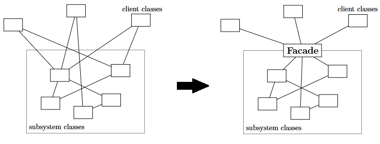
  <figcaption class="fig-caption">Interfaccia unificata tramite il Facade Pattern</figcaption>
</figure>

Il **Facade Pattern** fornisce un'interfaccia unificata, ad alto livello e fortemente semplificata verso un insieme eterogeneo di interfacce appartenenti a un sottosistema complesso. L'obiettivo primario di questa soluzione è mascherare le fitte interconnessioni, le dipendenze e i dettagli implementativi minuti dei moduli interni, offrendo all'esterno un unico punto di accesso lineare e pulito. È la scelta architetturale ideale quando si lavora con librerie strutturate o sotto-moduli articolati, permettendo ai programmatori di interagire con le funzioni di core business senza doverne padroneggiare le complessità e le configurazioni di basso livello.

La modellazione strutturale del pattern si basa su un'organizzazione minimale incentrata su due livelli:
* **Facade**: è la classe di facciata che espone i metodi di accesso semplificati per il client. Essa conosce l'esatta mappa delle responsabilità dei moduli interni e si fa carico di orchestrare e delegare le richieste ricevute verso le entità appropriate.
* **Subsystems**: rappresentano l'insieme dei vari componenti, classi e moduli indipendenti che realizzano le logiche di dettaglio del sistema complesso. Questi elementi operano ignorando l'esistenza della *Facade* e rimangono accessibili direttamente solo se il client necessita di configurazioni avanzate.

I vantaggi principali del Facade Pattern risiedono nella semplificazione radicale dell'interfaccia, elemento che riduce sensibilmente la curva di apprendimento per gli sviluppatori esterni e centralizza i punti di contatto del software. Separando i client dai dettagli implementativi interni, il pattern disaccoppia i moduli aumentando la manutenibilità e favorisce l'evoluzione indipendente dei singoli sottosistemi. Di contro, lo svantaggio potenziale è legato a una possibile perdita di flessibilità: nascondendo la complessità dietro un'interfaccia rigida, i client avanzati potrebbero trovare difficoltoso eseguire personalizzazioni granulari se la Facade non è stata progettata per esporle. Inoltre, se accentra troppe responsabilità del sistema, la classe Facade rischia di trasformarsi in un "God Object", un elemento centralizzato che complica l'estensibilità a lungo termine dell'applicazione.

```c++
#include <iostream>
#include <string>
#include <memory>

// ==========================================
// 1. COMPONENTI SUBSYSTEMS (Le classi complesse interne)
// ==========================================

class Amplificatore {
public:
    void accendi() { std::cout << "[Amplificatore] -> Acceso.\n"; }
    void impostaVolume(int vol) { std::cout << "[Amplificatore] -> Volume regolato a: " << vol << ".\n"; }
    void spegni() { std::cout << "[Amplificatore] -> Spento.\n"; }
};

class Proiettore {
public:
    void accendi() { std::cout << "[Proiettore] -> Acceso.\n"; }
    void impostaModalitaWidescreen() { std::cout << "[Proiettore] -> Modalità impostata su Cinema 16:9.\n"; }
    void spegni() { std::cout << "[Proiettore] -> Spento.\n"; }
};

class LettoreStreaming {
public:
    void accendi() { std::cout << "[Lettore Streaming] -> Acceso.\n"; }
    void riproduci(const std::string& film) { std::cout << "[Lettore Streaming] -> Avvio riproduzione del film: \"" << film << "\".\n"; }
    void ferma() { std::cout << "[Lettore Streaming] -> Riproduzione interrotta.\n"; }
    void spegni() { std::cout << "[Lettore Streaming] -> Spento.\n"; }
};

class LuciAmbiente {
public:
    void attenua(int percentuale) { std::cout << "[Luci Ambiente] -> Luminosità ridotta al " << percentuale << "% per la visione.\n"; }
    void ripristina() { std::cout << "[Luci Ambiente] -> Luminosità ripristinata al 100%.\n"; }
};


// ==========================================
// 2. COMPONENTE FACADE
// ==========================================
/**
 * @brief Classe Facade (SmartHomeFacade).
 * Coordina i sottosistemi complessi offrendo al client un'interfaccia 
 * ad alto livello composta da due sole funzioni: guardaFilm e terminaFilm.
 */
class SmartHomeFacade {
private:
    // Aggregazione dei sottosistemi tramite smart pointers
    std::unique_ptr<Amplificatore> ampli;
    std::unique_ptr<Proiettore> proiettore;
    std::unique_ptr<LettoreStreaming> lettore;
    std::unique_ptr<LuciAmbiente> luci;

public:
    SmartHomeFacade() {
        ampli = std::make_unique<Amplificatore>();
        proiettore = std::make_unique<Proiettore>();
        lettore = std::make_unique<LettoreStreaming>();
        luci = std::make_unique<LuciAmbiente>();
    }

    /**
     * @brief Nasconde l'ordine stringente di accensione e configurazione dei moduli.
     */
    void guardaFilm(const std::string& titoloFilm) {
        std::cout << "[Facade] Preparazione dell'ambiente per la visione del film...\n";
        
        luci->attenua(15);
        proiettore->accendi();
        proiettore->impostaModalitaWidescreen();
        ampli->accendi();
        ampli->impostaVolume(25);
        lettore->accendi();
        lettore->riproduci(titoloFilm);
        
        std::cout << "[Facade] Configurazione completata. Buona visione!\n";
    }

    /**
     * @brief Nasconde la sequenza corretta di spegnimento e ripristino dell'hardware.
     */
    void terminaFilm() {
        std::cout << "\n[Facade] Spegnimento del sistema Home Theater...\n";
        
        lettore->ferma();
        lettore->spegni();
        ampli->spegni();
        proiettore->spegni();
        luci->ripristina();
        
        std::cout << "[Facade] Tutti i dispositivi sono stati spenti in sicurezza.\n";
    }
};


// ==========================================
// 3. COMPONENTE CLIENT
// ==========================================
/**
 * @brief Il Client non ha bisogno di conoscere l'esistenza, l'ordine di inizializzazione
 * o i metodi specifici delle singole classi hardware. Interagisce solo con la Facade.
 */
int main() {
    std::cout << "--- Inizio esecuzione del programma Client (Facade Pattern) ---\n\n";

    // Istanziamo la Facciata
    SmartHomeFacade telecomandoUnificato;

    // Il client preme un solo pulsante logico per avviare l'intero ecosistema
    telecomandoUnificato.guardaFilm("Inception");

    // Il client preme un solo pulsante logico per smantellare l'ecosistema
    telecomandoUnificato.terminaFilm();

    std::cout << "\n--- Fine esecuzione del programma Client ---\n";
    return 0;
}
```

---

### Composite Pattern

<figure class="fig-float center" style="width: 70%;">
  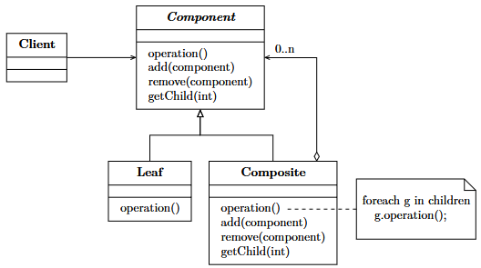
  <figcaption class="fig-caption">Modellazione ad albero nel Composite Pattern</figcaption>
</figure>

Il **Composite Pattern** è un pattern strutturale concepito per organizzare gli oggetti all'interno di strutture gerarchiche ad albero in modo da rappresentare relazioni del tipo "parte-tutto". La peculiarità fondamentale di questo pattern risiede nella capacità di consentire ai client di trattare i singoli oggetti atomici e i contenitori complessi (le composizioni di oggetti) in modo del tutto uniforme. Grazie a questa astrazione, la logica di business esterna può invocare la medesima operazione su qualsiasi nodo della struttura, ignorando se l'elemento corrente sia una singola entità terminale o un intero ramo composto da centinaia di sotto-oggetti.

I componenti costitutivi definiti in UML seguono la tipica tassonomia delle strutture ad albero:
* **Component**: è l'interfaccia o la classe astratta che dichiara le operazioni comuni sia agli oggetti atomici sia ai nodi contenitori, stabilendo il contratto polimorfo condiviso da tutti gli elementi della gerarchia.
* **Leaf**: rappresenta l'oggetto foglia, ovvero l'elemento terminale singolo che non possiede figli all'interno dell'albero. Implementa direttamente le operazioni definite in *Component*.
* **Composite**: è la classe che incapsula i nodi intermedi capaci di ospitare al proprio interno una collezione di altri oggetti di tipo *Component* (sia foglie sia altri nodi composti). Oltre a implementare le funzioni di business delegandole ai propri figli, espone i metodi per manipolare e scorrere la struttura (come l'aggiunta o la rimozione di nodi).

Tra i vantaggi del Composite spicca l'elevata semplificazione del codice del client, il quale viene sollevato dall'obbligo di inserire costrutti condizionali per distinguere tra elementi singoli e collezioni, riducendo la complessità ciclomatica del software. Rende inoltre il sistema altamente estensibile, consentendo l'introduzione di nuovi tipi di foglie o nodi composti senza alterare l'architettura esistente. Tuttavia, presenta degli svantaggi associati alla rigidità del design: l'omogeneità imposta dall'interfaccia *Component* rende complesso limitare l'inserimento di determinati tipi di elementi nei nodi composti, spostando la verifica dei vincoli di compatibilità dal tempo di compilazione al tempo di esecuzione con controlli di tipo *type-checking* a runtime.

```c++
#include <iostream>
#include <string>
#include <vector>
#include <memory>
#include <algorithm>

// ==========================================
// 1. COMPONENTE COMPONENT
// ==========================================
/**
 * @brief Interfaccia comune per tutti gli elementi del File System.
 * Stabilisce il contratto polimorfo sia per i file singoli che per le cartelle.
 */
class FileSystemElementComponent {
protected:
    std::string nome;

public:
    FileSystemElementComponent(const std::string& n) : nome(n) {}
    virtual ~FileSystemElementComponent() = default;

    std::string getNome() const { return nome; }

    // Operazione di core business che verrà eseguita in modo uniforme
    virtual void stampa(const std::string& indentazione = "") const = 0;

    // Metodi opzionali per la gestione dei figli (specifici del Composite)
    virtual void aggiungi(std::shared_ptr<FileSystemElementComponent> elemento) {
        // Implementazione di default vuota o che lancia un'eccezione runtime
        throw std::runtime_error("Operazione non supportata su un elemento foglia.");
    }
    
    virtual void rimuovi(std::shared_ptr<FileSystemElementComponent> elemento) {
        throw std::runtime_error("Operazione non supportata su un elemento foglia.");
    }
};


// ==========================================
// 2. COMPONENTE LEAF (La Foglia)
// ==========================================
/**
 * @brief Rappresenta un singolo File. È un nodo terminale: non può contenere altri elementi.
 */
class FileLeaf : public FileSystemElementComponent {
private:
    int dimensioneKb;

public:
    FileLeaf(const std::string& n, int dim) 
        : FileSystemElementComponent(n), dimensioneKb(dim) {}

    /**
     * @brief Implementa l'operazione specifica stampando i dettagli del file.
     */
    void stampa(const std::string& indentazione) const override {
        std::cout << indentazione << "- [File] " << nome << " (" << dimensioneKb << " KB)\n";
    }
};


// ==========================================
// 3. COMPONENTE COMPOSITE (Il Contenitore)
// ==========================================
/**
 * @brief Rappresenta una Cartella (Directory). 
 * Può contenere una collezione di altri oggetti di tipo Component (File o altre Cartelle).
 */
class CartellaComposite : public FileSystemElementComponent {
private:
    // Lista di puntatori condivisibili agli elementi figli
    std::vector<std::shared_ptr<FileSystemElementComponent>> figli;

public:
    CartellaComposite(const std::string& n) : FileSystemElementComponent(n) {}

    // Override dei metodi di manipolazione della struttura ad albero
    void aggiungi(std::shared_ptr<FileSystemElementComponent> elemento) override {
        figli.push_back(elemento);
    }

    void rimuovi(std::shared_ptr<FileSystemElementComponent> elemento) override {
        figli.erase(std::remove(figli.begin(), figli.end(), elemento), figli.end());
    }

    /**
     * @brief Implementa l'operazione di business delegandola ricorsivamente ai propri figli.
     */
    void stampa(const std::string& indentazione) const override {
        std::cout << indentazione << "+ [Cartella] " << nome << "\n";
        
        // Delega polimorfica: scorre l'intera collezione interna
        for (const auto& figlio : figli) {
            // Incrementa l'indentazione visiva per i nodi sottostanti
            figlio->stampa(indentazione + "  ");
        }
    }
};


// ==========================================
// 4. COMPONENTE CLIENT
// ==========================================
/**
 * @brief Il Client interagisce uniformemente con qualsiasi elemento tramite la classe base,
 * eliminando i costrutti if-else di controllo sul tipo di nodo.
 */
int main() {
    std::cout << "--- Inizio esecuzione del programma Client (Composite Pattern) ---\n\n";

    // 1. Creazione di elementi foglia indipendenti
    auto file1 = std::make_shared<FileLeaf>("tesi.pdf", 2450);
    auto file2 = std::make_shared<FileLeaf>("schema_uml.png", 512);
    auto file3 = std::make_shared<FileLeaf>("canzone.mp3", 4200);

    // 2. Creazione del nodo radice (Root) e di una sottocartella (Sub-Composite)
    auto radice = std::make_shared<CartellaComposite>("Home_Utente");
    auto documenti = std::make_shared<CartellaComposite>("Documenti_Universitari");

    // 3. Composizione della struttura gerarchica ad albero
    documenti->aggiungi(file1);
    documenti->aggiungi(file2); // 'documenti' ora contiene due file
    
    radice->aggiungi(documenti); // Inseriamo la sottocartella nella radice
    radice->aggiungi(file3);     // Inseriamo un file direttamente nella radice

    // 4. Esecuzione uniforme dell'operazione
    std::cout << "Rendering dell'intera gerarchia (Invocazione sulla Radice):\n";
    radice->stampa(); // Avvia il ciclo ricorsivo automatico

    std::cout << "\nRendering di un sotto-albero isolato (Invocazione sul Singolo Ramo):\n";
    documenti->stampa(); // Il client tratta il ramo esattamente come la radice

    std::cout << "\n--- Fine esecuzione del programma Client ---\n";
    return 0;
}
```

---

### Decorator Pattern

<figure class="fig-float center" style="width: 75%;">
  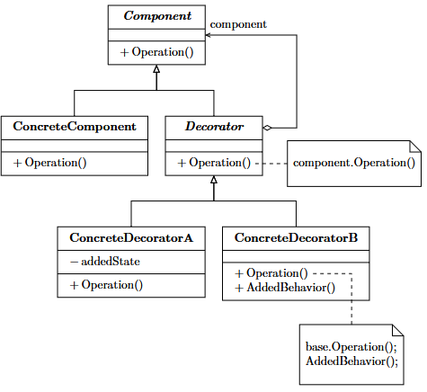
  <figcaption class="fig-caption">Estensione dinamica tramite Decorator</figcaption>
</figure>

Il **Decorator Pattern** è una soluzione strutturale progettata per assegnare dinamicamente e a runtime ulteriori responsabilità e comportamenti a un singolo oggetto, senza alterarne la struttura interna o impattare sulle altre istanze della stessa classe. Questo pattern concretizza uno dei principi cardine della programmazione orientata agli oggetti, ovvero l'utilizzo della composizione di codice in sostituzione dell'ereditarietà statica. Evita la creazione di rigide e ramificate gerarchie di sottoclassi che tentano di mappare a tempo di compilazione tutte le possibili combinazioni di funzionalità richieste dal sistema.

La struttura delle classi descrive una relazione ricorsiva basata su quattro attori principali:
* **Component**: è l'interfaccia comune che fissa le operazioni di base condivisibili sia dall'oggetto principale sia dai moduli di decorazione ad esso applicati.
* **ConcreteComponent**: definisce l'oggetto concreto di partenza che realizza il comportamento base e che può essere progressivamente arricchito dalle decorazioni.
* **Decorator**: è la classe astratta che implementa l'interfaccia *Component* e, simultaneamente, mantiene una referenza privata a un oggetto di tipo *Component*. Ha il compito di conformarsi al contratto comune e di delegare le chiamate standard all'istanza interna che sta avvolgendo (*wrapping*).
* **ConcreteDecorator**: rappresenta la classe concreta che estende il *Decorator* di base, inserendo le nuove funzionalità, comportamenti o controlli prima o dopo aver inoltrato la richiesta all'oggetto interno.

Il pregio fondamentale del Decorator risiede nell'estrema flessibilità architetturale che garantisce, permettendo di combinare molteplici decoratori tra loro a runtime per generare comportamenti stratificati e complessi, in perfetta aderenza con il principio *Open/Closed*. Di contro, lo svantaggio riscontrabile risiede nella proliferazione di una moltitudine di piccole classi focalizzate su dettagli minimi, dinamica che può rendere l'architettura frammentata. Questa stratificazione ad "avvolgimento" può rendere significativamente più complessa l'attività di debugging, in quanto tracciare il flusso di esecuzione richiede il passaggio attraverso una catena concatenata di proxy e decoratori, rendendo difficile l'immediata individuazione del punto esatto in cui avviene l'elaborazione dei dati.

```c++
#include <iostream>
#include <string>
#include <memory>

// ==========================================
// 1. COMPONENTE COMPONENT
// ==========================================
/**
 * @brief Interfaccia comune per l'oggetto originale e per tutti i decoratori.
 */
class BevandaComponent {
public:
    virtual ~BevandaComponent() = default;
    virtual std::string getDescrizione() const = 0;
    virtual double getCosto() const = 0;
};


// ==========================================
// 2. COMPONENTE CONCRETECOMPONENT
// ==========================================
/**
 * @brief L'oggetto concreto di partenza. Realizza il comportamento base
 * (un semplice Caffè Espresso) privo di decorazioni aggiuntive.
 */
class EspressoConcreteComponent : public BevandaComponent {
public:
    std::string getDescrizione() const override {
        return "Caffe Espresso";
    }

    double getCosto() const override {
        return 1.20; // Prezzo base
    }
};


// ==========================================
// 3. COMPONENTE DECORATOR (Classe Astratta Base)
// ==========================================
/**
 * @brief Implementa l'interfaccia Component e mantiene una referenza privata/protetta
 * a un oggetto di tipo Component da avvolgere (wrapping).
 */
class IngredienteDecorator : public BevandaComponent {
protected:
    // Puntatore all'oggetto Component (può essere un ConcreteComponent o un altro Decorator)
    std::unique_ptr<BevandaComponent> bevandaIncartata;

public:
    IngredienteDecorator(std::unique_ptr<BevandaComponent> b) : bevandaIncartata(std::move(b)) {}
    
    // Delega di default il comportamento all'oggetto interno
    std::string getDescrizione() const override {
        return bevandaIncartata->getDescrizione();
    }

    double getCosto() const override {
        return bevandaIncartata->getCosto();
    }
};


// ==========================================
// 4. COMPONENTI CONCRETEDECORATOR (I Decoratori Specifici)
// ==========================================
/**
 * @brief Decoratore Concreto A. Aggiunge l'estensione "Latte" e aggiorna il prezzo.
 */
class ConLatteDecorator : public IngredienteDecorator {
public:
    // Passa l'oggetto al costruttore della classe base Decorator
    ConLatteDecorator(std::unique_ptr<BevandaComponent> b) : IngredienteDecorator(std::move(b)) {}

    // Estende dinamicamente la descrizione
    std::string getDescrizione() const override {
        return IngredienteDecorator::getDescrizione() + ", con schiuma di Latte";
    }

    // Aggiunge il proprio costo specifico a quello dell'oggetto interno
    double getCosto() const override {
        return IngredienteDecorator::getCosto() + 0.40;
    }
};

/**
 * @brief Decoratore Concreto B. Aggiunge l'estensione "Caramello" e aggiorna il prezzo.
 */
class ConCaramelloDecorator : public IngredienteDecorator {
public:
    ConCaramelloDecorator(std::unique_ptr<BevandaComponent> b) : IngredienteDecorator(std::move(b)) {}

    std::string getDescrizione() const override {
        return IngredienteDecorator::getDescrizione() + ", con topping al Caramello";
    }

    double getCosto() const override {
        return IngredienteDecorator::getCosto() + 0.55;
    }
};


// ==========================================
// 5. COMPONENTE CLIENT
// ==========================================
/**
 * @brief Il Client può stratificare i decoratori a runtime sopra l'oggetto base,
 * assemblando le configurazioni senza ricorrere a un'esplosione di sottoclassi statiche.
 */
int main() {
    std::cout << "--- Inizio esecuzione del programma Client (Decorator Pattern) ---\n\n";

    std::cout << "1. Ordinazione di una bevanda semplice (Base):\n";
    std::unique_ptr<BevandaComponent> miaBevanda = std::make_unique<EspressoConcreteComponent>();
    std::cout << " -> Prodotto: " << miaBevanda->getDescrizione() << "\n";
    std::cout << " -> Prezzo Totale: " << miaBevanda->getCosto() << " Euro\n\n";

    std::cout << "2. Aggiunta dinamica di un primo decoratore (Latte):\n";
    // Avvolgiamo l'espresso nel decoratore Latte
    miaBevanda = std::make_unique<ConLatteDecorator>(std::move(miaBevanda));
    std::cout << " -> Prodotto: " << miaBevanda->getDescrizione() << "\n";
    std::cout << " -> Prezzo Totale: " << miaBevanda->getCosto() << " Euro\n\n";

    std::cout << "3. Aggiunta dinamica di un secondo decoratore sopra la catena preesistente (Caramello):\n";
    // Avvolgiamo l'espresso+latte nel decoratore Caramello
    miaBevanda = std::make_unique<ConCaramelloDecorator>(std::move(miaBevanda));
    std::cout << " -> Prodotto: " << miaBevanda->getDescrizione() << "\n";
    std::cout << " -> Prezzo Totale: " << miaBevanda->getCosto() << " Euro\n";

    std::cout << "\n--- Fine esecuzione del programma Client ---\n";
    return 0;
}
```
---

### Flyweight Pattern

<figure class="fig-float center" style="width: 80%;">
  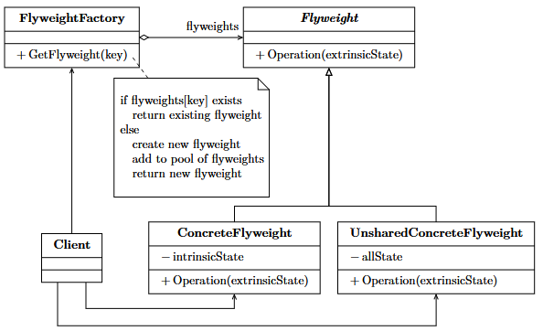
  <figcaption class="fig-caption">Ottimizzazione della memoria con il Flyweight Pattern</figcaption>
</figure>

Il **Flyweight Pattern** è un pattern strutturale esplicitamente finalizzato all'ottimizzazione e alla riduzione del consumo di memoria volatile (RAM) all'interno di applicazioni che si trovano a dover gestire l'istanziazione simultanea di un numero estremamente elevato di oggetti simili. La strategia del pattern si basa sulla scomposizione rigorosa dello stato dell'oggetto in due componenti distinte: lo **stato intrinseco**, che rappresenta le informazioni immutabili e condivisibili tra tutte le istanze (es. i dati grafici di un carattere), e lo **stato estrinseco**, che individua le informazioni variabili condizionate dal contesto e specifiche della singola istanza (es. la posizione nello spazio), le quali vengono memorizzate ed elaborate esternamente dal client.

I moduli logici necessari a coordinare la condivisione dello stato sono articolati in cinque entità:
* **Flyweight**: è l'interfaccia comune che definisce i metodi attraverso i quali l'oggetto riceve lo stato estrinseco come parametro per poter operare correttamente.
* **ConcreteFlyweight**: implementa l'interfaccia *Flyweight* e si fa carico di memorizzare in modo permanente lo stato intrinseco condivisibile, garantendone l'immutabilità.
* **UnsharedConcreteFlyweight**: individua eventuali sottoclassi conformi all'interfaccia che, per vincoli progettuali, non possono essere condivise e mantengono l'intero stato al proprio interno.
* **FlyweightFactory**: è la fabbrica di controllo deputata a gestire il pool degli oggetti condivisibili. Quando il client richiede un elemento, la factory verifica se sia già presente in memoria per restituirlo, procedendo all'istanziazione ex novo solo se strettamente necessario.
* **Client**: memorizza o calcola lo stato estrinseco del sistema e interagisce con gli oggetti condivisi estraendoli unicamente dalla *FlyweightFactory*.

Il vantaggio primario di questa soluzione è il drastico risparmio di risorse di memoria, fattore che in molti casi previene fenomeni di saturazione o rallentamenti causati dal Garbage Collector. Separando nettamente i dati stabili da quelli variabili, si ottiene un'organizzazione efficiente delle informazioni strutturate. Tuttavia, gli svantaggi risiedono in un incremento sensibile della complessità algoritmica del sistema, causato dalla necessità di calcolare e iniettare costantemente lo stato estrinseco durante il runtime. Inoltre, la centralizzazione degli accessi tramite la *FlyweightFactory* introduce un overhead computazionale iniziale che potrebbe non giustificare l'investimento progettuale se il numero di istanze reali non è sufficientemente elevato da generare un reale beneficio di memoria.

```c++
#include <iostream>
#include <string>
#include <unordered_map>
#include <memory>
#include <vector>

// ==========================================
// 1. COMPONENTE FLYWEIGHT & CONCRETEFLYWEIGHT
// ==========================================
/**
 * @brief Interfaccia Flyweight.
 * Declara i metodi che accettano lo stato estrinseco (le coordinate) come parametro.
 */
class TipoAlberoFlyweight {
private:
    // STATO INTRINSECO: Dati condivisi, pesanti e immutabili
    std::string nome;
    std::string colore;
    std::string datiTextureDettagliati; // Simula molti MB di dati grafici

public:
    TipoAlberoFlyweight(const std::string& n, const std::string& c, const std::string& tex)
        : nome(n), colore(c), datiTextureDettagliati(tex) {
        std::cout << "[Flyweight] Creato nuovo tipo di albero condivisibile: " << nome 
                  << " [Texture caricata in RAM]\n";
    }

    /**
     * @brief Esegue un'operazione combinando lo stato intrinseco con lo stato estrinseco passato dal client.
     * @param x Coordinata X (Stato Estrinseco)
     * @param y Coordinata Y (Stato Estrinseco)
     */
    void disegna(int x, int y) const {
        std::cout << " -> Rendering di '" << nome << "' (" << colore 
                  << ") in posizione geografica X:" << x << ", Y:" << y 
                  << " [Usa Texture condivisa a indirizzo: " << this << "]\n";
    }
};


// ==========================================
// 2. COMPONENTE FLYWEIGHTFACTORY
// ==========================================
/**
 * @brief Gestisce il pool di oggetti Flyweight, garantendo il riutilizzo e l'unicità.
 */
class AlberoFactory {
private:
    // Tabella hash per indicizzare i flyweight esistenti usando una chiave univoca
    std::unordered_map<std::string, std::shared_ptr<TipoAlberoFlyweight>> poolAlberi;

public:
    /**
     * @brief Restituisce un Flyweight esistente o ne crea uno nuovo se non presente.
     */
    std::shared_ptr<TipoAlberoFlyweight> getTipoAlbero(const std::string& nome, const std::string& colore, const std::string& texture) {
        std::string chiave = nome + "_" + colore;

        // Se il flyweight esiste già nel pool, lo restituiamo senza allocare nuova memoria
        if (poolAlberi.find(chiave) != poolAlberi.end()) {
            return poolAlberi[chiave];
        }

        // Altrimenti, viene istanziato ex novo e inserito nel pool
        auto nuovoFlyweight = std::make_shared<TipoAlberoFlyweight>(nome, colore, texture);
        poolAlberi[chiave] = nuovoFlyweight;
        return nuovoFlyweight;
    }

    size_t getNumeroTotaleFlyweight() const {
        return poolAlberi.size();
    }
};


// ==========================================
// 3. COMPONENTE CONTEXT (Client-Side Helper)
// ==========================================
/**
 * @brief Contiene lo stato estrinseco e un riferimento al Flyweight condiviso.
 * Questa classe è estremamente "leggera" in termini di memoria occupata.
 */
class AlberoContext {
private:
    // STATO ESTRINSECO: Dati unici per ogni albero, variabili e legati al contesto
    int coordinataX;
    int coordinataY;

    // Riferimento allo stato intrinseco condiviso
    std::shared_ptr<TipoAlberoFlyweight> tipo;

public:
    AlberoContext(int x, int y, std::shared_ptr<TipoAlberoFlyweight> t)
        : coordinataX(x), coordinataY(y), tipo(t) {}

    void renderizza() const {
        // Iniettiamo lo stato estrinseco nel flyweight condiviso al momento del bisogno
        tipo->disegna(coordinataX, coordinataY);
    }
};


// ==========================================
// 4. COMPONENTE CLIENT
// ==========================================
/**
 * @brief Il Client (il motore della foresta) gestisce l'elenco dei contesti leggeri.
 */
class ForestaClient {
private:
    std::vector<AlberoContext> alberi;
    AlberoFactory factory;

public:
    void piantaAlbero(int x, int y, const std::string& nome, const std::string& colore, const std::string& texture) {
        // Estraiamo il flyweight condiviso dalla factory
        auto tipo = factory.getTipoAlbero(nome, colore, texture);
        // Creiamo il contesto leggero e lo inseriamo nel vettore della foresta
        alberi.emplace_back(x, y, tipo);
    }

    void disegnaForesta() const {
        std::cout << "\n[Foresta Client] Avvio del rendering di tutti gli alberi del mondo di gioco:\n";
        for (const auto& albero : alberi) {
            albero.renderizza();
        }
    }

    void mostraStatistiche() const {
        std::cout << "\n--- STATISTICHE MEMORIA ---"
                  << "\nAlberi totali istanziati nel mondo (Contesti): " << alberi.size()
                  << "\nOggetti pesanti allocati effettivamente in RAM (Flyweight): " << factory.getNumeroTotaleFlyweight()
                  << "\n---------------------------\n";
    }
};

int main() {
    std::cout << "--- Inizio esecuzione del programma Client (Flyweight Pattern) ---\n\n";

    ForestaClient mappaGioco;

    std::cout << "1. Generazione procedurale e popolamento della mappa di gioco...\n";
    // Piantiamo molti alberi dello stesso tipo in posizioni diverse
    mappaGioco.piantaAlbero(10, 20, "Quercia", "Verde", "texture_quercia_hd.png");
    mappaGioco.piantaAlbero(15, 35, "Quercia", "Verde", "texture_quercia_hd.png");
    mappaGioco.piantaAlbero(50, 12, "Quercia", "Verde", "texture_quercia_hd.png");

    // Piantiamo alberi di un secondo tipo
    mappaGioco.piantaAlbero(100, 200, "Pino", "Verde Scuro", "texture_pino_hd.png");
    mappaGioco.piantaAlbero(105, 210, "Pino", "Verde Scuro", "texture_pino_hd.png");

    // Mostriamo l'efficienza del pool
    mappaGioco.mostraStatistiche();

    // 2. Esecuzione del rendering
    mappaGioco.disegnaForesta();

    std::cout << "\n--- Fine esecuzione del programma Client ---\n";
    return 0;
}
```
---

### Proxy Pattern

<figure class="fig-float center" style="width: 75%;">
  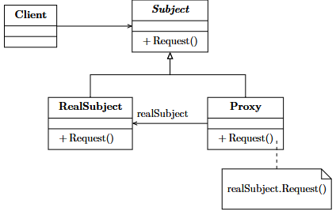
  <figcaption class="fig-caption">Intermediazione degli accessi tramite Proxy Pattern</figcaption>
</figure>

Il **Proxy Pattern** (noto anche come *Surrogato*) introduce un oggetto intermediario che si posiziona come sostituto o punto di controllo di un'altra risorsa reale denominata **RealSubject**. Il proxy espone la medesima interfaccia dell'oggetto reale, configurandosi come una barriera trasparente per il client; questa posizione strategica gli permette di intercettare tutte le richieste dirette alla risorsa principale per applicare logiche trasversali, tra cui il controllo degli accessi, la cifratura dei dati, il tracciamento delle attività (*logging*), la gestione di connessioni remote (*Remote Proxy*) o il caricamento differito (*Virtual Proxy* o *Lazy Loading*) di oggetti particolarmente onerosi in termini computazionali.

I componenti strutturali del pattern condividono un'ereditarietà comune per garantire la trasparenza d'uso:
* **Subject**: è l'interfaccia o la classe astratta comune che fissa i metodi di business standard esposti sia dal proxy sia dall'oggetto reale, permettendo al surrogato di sostituirsi al destinatario senza che il client debba accorgersene.
* **RealSubject**: rappresenta l'oggetto concreto effettivo che contiene la logica di business principale e che deve essere protetto o ottimizzato dall'intermediario.
* **Proxy**: è la classe intermediaria che implementa l'interfaccia *Subject* e mantiene un riferimento interno a *RealSubject*. Governa il ciclo di vita dell'oggetto reale, decidendo se e quando inoltrargli le richieste in base alle verifiche effettuate.

I vantaggi del Proxy includono la possibilità di gestire la sicurezza e l'allocazione delle risorse in modo isolato, lasciando la classe principale focalizzata unicamente sulle proprie logiche di business. Consente di implementare efficaci sistemi di caching dei risultati e ottimizza i tempi di avvio delle applicazioni rinviando l'inizializzazione dei moduli pesanti fino al momento del loro reale utilizzo. Di contro, lo svantaggio primario si riscontra nell'introduzione di un ulteriore livello di indirezione logica che, se non strutturato correttamente, rischia di incrementare la latenza delle risposte. L'intermediazione forzata può inoltre complicare la manutenibilità del codice e rendere più ostico il tracciamento degli errori in fase di debugging, dal momento che il flusso esecutivo viene costantemente mediato dall'entità surrogata.

```c++
#include <iostream>
#include <string>
#include <memory>

// ==========================================
// 1. COMPONENTE SUBJECT
// ==========================================
/**
 * @brief Interfaccia comune che definisce il contratto per il Proxy e il RealSubject.
 * Permette al Proxy di sostituirsi in modo trasparente all'oggetto reale.
 */
class DocumentoPesanteSubject {
public:
    virtual ~DocumentoPesanteSubject() = default;
    virtual void visualizza() = 0;
};


// ==========================================
// 2. COMPONENTE REALSUBJECT
// ==========================================
/**
 * @brief L'oggetto reale che contiene la logica di business principale.
 * Il suo costruttore simula un'operazione estremamente onerosa (es. caricamento da disco o rete).
 */
class RealDocumentoPesante : public DocumentoPesanteSubject {
private:
    std::string nomeFile;

    void caricaDaDisco() {
        std::cout << "[RealSubject] -> Caricamento in corso del file pesante: '" 
                  << nomeFile << "' (Allocazione memoria e parsing in corso...)\n";
    }

public:
    RealDocumentoPesante(const std::string& nome) : nomeFile(nome) {
        // L'inizializzazione avviene subito al momento della creazione
        caricaDaDisco();
    }

    void visualizza() override {
        std::cout << "[RealSubject] -> Rendering a schermo del contenuto del documento: " << nomeFile << "\n";
    }
};


// ==========================================
// 3. COMPONENTE PROXY
// ==========================================
/**
 * @brief Il Proxy (Virtual Proxy).
 * Gestisce l'accesso e controlla il ciclo di vita del RealSubject, 
 * istanziandolo solo quando strettamente necessario (Lazy Initialization).
 */
class ProxyDocumento : public DocumentoPesanteSubject {
private:
    std::string nomeFile;
    // Riferimento interno all'oggetto reale, inizialmente non allocato (nullo)
    std::unique_ptr<RealDocumentoPesante> documentoReale;

public:
    ProxyDocumento(const std::string& nome) : nomeFile(nome), documentoReale(nullptr) {
        // Il proxy è leggero: memorizza solo i metadati, non istanzia l'oggetto pesante
        std::cout << "[Proxy] Creato il surrogato per '" << nomeFile << "'. Nessuna risorsa ancora allocata.\n";
    }

    /**
     * @brief Intercetta la chiamata. Se l'oggetto reale non esiste ancora, 
     * lo crea sul momento, poi inoltra la richiesta.
     */
    void visualizza() override {
        std::cout << "[Proxy] Intercettata richiesta di visualizzazione.\n";
        
        // Controllo e caricamento differito (Lazy Loading)
        if (!documentoReale) {
            std::cout << "[Proxy] Rilevato oggetto reale non istanziato. Avvio inizializzazione on-demand...\n";
            documentoReale = std::make_unique<RealDocumentoPesante>(nomeFile);
        } else {
            std::cout << "[Proxy] Oggetto reale già presente in memoria (Caching dell'istanza).\n";
        }

        // Delega finale all'oggetto reale
        documentoReale->visualizza();
    }
};


// ==========================================
// 4. COMPONENTE CLIENT
// ==========================================
/**
 * @brief Il Client interagisce polimorficamente con l'interfaccia Subject,
 * senza sapere se sta parlando con il Proxy o con l'oggetto reale.
 */
int main() {
    std::cout << "--- Inizio esecuzione del programma Client (Proxy Pattern) ---\n\n";

    std::cout << "1. Creazione dell'oggetto proxy (es. avvio di una dashboard con molti allegati):\n";
    std::unique_ptr<DocumentoPesanteSubject> mioDocumento = std::make_unique<ProxyDocumento>("Bilancio_Aziendale_2026.pdf");
    
    std::cout << "\n-> L'applicazione è partita ed è fluida perché il documento non è stato ancora caricato.\n";

    std::cout << "\n2. Il client fa click sul documento per la PRIMA VOLTA:\n";
    // Solo a questo punto scatta l'inizializzazione onerosa del RealSubject
    mioDocumento->visualizza();

    std::cout << "\n3. Il client fa click sul documento per la SECONDA VOLTA:\n";
    // Il proxy salta l'inizializzazione e riutilizza l'istanza precedentemente allocata
    mioDocumento->visualizza();

    std::cout << "\n--- Fine esecuzione del programma Client ---\n";
    return 0;
}
```

## Design Pattern Comportamentali

I **Design Pattern Comportamentali** sono incentrati sugli algoritmi, sulle dinamiche di comunicazione e sulla ripartizione delle responsabilità tra gli oggetti a runtime. Mentre i pattern strutturali si focalizzano sul modo in cui le entità sono collegate tra loro, i modelli comportamentali descrivono i flussi di controllo e i pattern di interazione complessi, riducendo l'accoppiamento rigido e permettendo agli oggetti di cooperare in modo flessibile e dinamicamente scambiabile.

I design pattern comportamentali più diffusi nell'ingegneria del software sono i seguenti (ordinati in modo crescente per complessità e astrazione nelle interazioni):
* **State Pattern**: permette a un oggetto di alterare il proprio comportamento in risposta al mutamento del suo stato interno, simulando la transizione tra classi differenti.
* **Observer Pattern**: stabilisce una dipendenza uno-a-molti tra oggetti, assicurando che la modifica dello stato di un'entità centrale si rifletta nella notifica e nell'aggiornamento automatico di tutti i componenti registrati.
* **Strategy Pattern**: definisce una famiglia di algoritmi intercambiabili, incapsulandoli all'interno di classi dedicate per consentire al client di selezionare la logica computazionale più idonea a runtime.

---

### State Pattern

<figure class="fig-float center" style="width: 75%;">
  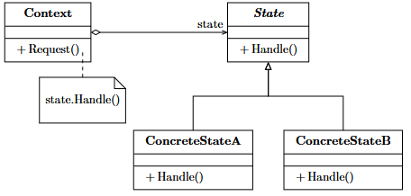
  <figcaption class="fig-caption">Struttura delle classi nel pattern State</figcaption>
</figure>

Lo **State Pattern** è una soluzione architetturale comportamentale che consente a un oggetto di variare il proprio comportamento a runtime in concomitanza con le modifiche del suo stato interno, operando in modo analogo a una macchina a stati finiti (FSM). Questo approccio è progettato per eliminare i grandi ed estesi blocchi condizionali (come i costrutti `if-else` o `switch-case` nidificati) dedicati alla gestione dei flussi applicativi, frammentando le logiche di stato in classi autonome, isolate e facilmente manutenibili.

La modellazione strutturale in UML si sviluppa attraverso tre componenti essenziali:
* **Context**: è la classe principale che mantiene la referenza verso l'istanza dello stato corrente ed espone i metodi di business verso l'esterno, delegando l'effettiva esecuzione delle operazioni all'oggetto di stato attualmente attivo.
* **State**: rappresenta l'interfaccia o la classe astratta comune che fissa il contratto polimorfo per tutte le possibili ramificazioni e condizioni di comportamento concrete del sistema.
* **ConcreteState**: individua le implementazioni specifiche di ciascuno stato. Ogni classe concreta incapsula il comportamento logico associato a quella determinata fase e, frequentemente, coordina anche i criteri di innesco per la transizione verso lo stato successivo.

Il pregio fondamentale di questo pattern risiede nella radicale pulizia del codice ottenuta rimuovendo le strutture di controllo complesse, a vantaggio di un'ottima modularità che permette di testare e isolare ogni singolo stato in modo indipendente. Sostiene attivamente l'estensibilità, facilitando l'introduzione di nuove condizioni senza impattare sul codice preesistente del *Context*. Di contro, tra gli svantaggi si evidenzia un incremento sensibile della complessità progettuale a causa della proliferazione del numero di classi nel sistema. Inoltre, il debugging delle transizioni dinamiche può risultare meno immediato e l'architettura rischia di generare un accoppiamento indiretto tra le classi *ConcreteState* qualora queste debbano conoscere esplicitamente i nodi di destinazione per governare i passaggi di stato.

```c++
#include <iostream>
#include <memory>
#include <string>

// Pre-dichiarazione della classe Context per permettere allo Stato di referenziarla
class DistributoreContext;

// ==========================================
// 1. COMPONENTE STATE (Interfaccia Astratta)
// ==========================================
/**
 * @brief Interfaccia comune per tutti gli stati possibili del distributore.
 * Ogni metodo rappresenta una potenziale azione o evento scatenato dall'utente.
 */
class StatoDistributore {
public:
    virtual ~StatoDistributore() = default;
    virtual void inserisciMoneta(DistributoreContext& context) = 0;
    virtual void premiPulsanteErogazione(DistributoreContext& context) = 0;
    virtual void erogaProdotto(DistributoreContext& context) = 0;
    virtual std::string getNomeStato() const = 0;
};


// ==========================================
// 2. COMPONENTE CONTEXT
// ==========================================
/**
 * @brief La classe principale che mantiene il riferimento allo stato corrente
 * e delega ad esso l'esecuzione dei comportamenti di business.
 */
class DistributoreContext {
private:
    // Lo smart pointer memorizza polimorficamente lo stato attivo
    std::unique_ptr<StatoDistributore> statoCorrente;

public:
    DistributoreContext(std::unique_ptr<StatoDistributore> statoIniziale) {
        cambiaStato(std::move(statoIniziale));
    }

    /**
     * @brief Permette alle classi ConcreteState di innescare la transizione di stato.
     */
    void cambiaStato(std::unique_ptr<StatoDistributore> nuovoStato) {
        statoCorrente = std::move(nuovoStato);
        std::cout << "[Context] Transizione completata. Stato attuale: " << statoCorrente->getNomeStato() << "\n";
    }

    // Metodi di interfaccia per il client (interamente delegati allo stato corrente)
    void inserisciMoneta() {
        statoCorrente->inserisciMoneta(*this);
    }

    void premiPulsanteErogazione() {
        statoCorrente->premiPulsanteErogazione(*this);
    }

    void erogaProdotto() {
        statoCorrente->erogaProdotto(*this);
    }
};


// ==========================================
// 3. COMPONENTI CONCRETESTATE
// ==========================================

// Pre-dichiarazione degli stati concreti per permetterne il concatenamento reciproco
class StatoMonetaInserita;
class StatoInAttesaDiMoneta;

/**
 * @brief Stato Concreto A: Il distributore è vuoto o attende il pagamento.
 */
class StatoInAttesaDiMoneta : public StatoDistributore {
public:
    std::string getNomeStato() const override { return "IN_ATTESA_DI_MONETA"; }

    void inserisciMoneta(DistributoreContext& context) override; // Definita sotto per ordine di compilazione

    void premiPulsanteErogazione(DistributoreContext&) override {
        std::cout << " -> Errore: Non puoi erogare nulla. Inserisci prima una moneta.\n";
    }

    void erogaProdotto(DistributoreContext&) override {
        std::cout << " -> Errore: Nessun prodotto da prelevare.\n";
    }
};

/**
 * @brief Stato Concreto B: L'utente ha inserito il denaro.
 */
class StatoMonetaInserita : public StatoDistributore {
public:
    std::string getNomeStato() const override { return "MONETA_INSERITA"; }

    void inserisciMoneta(DistributoreContext&) override {
        std::cout << " -> Info: C'è già una moneta all'interno del sistema.\n";
    }

    void premiPulsanteErogazione(DistributoreContext& context) override {
        std::cout << "[Stato: Moneta Inserita] Pulsante premuto. Preparazione del prodotto...\n";
        // Effettua la transizione automatica allo stato successivo di erogazione
        context.cambiaStato(std::make_unique<StatoInAttesaDiMoneta>()); 
        // Nota: in uno scenario reale passerebbe a "StatoProdottoErogato", 
        // qui torniamo alla base per semplicità di ciclo.
    }

    void erogaProdotto(DistributoreContext&) override {
        std::cout << " -> Errore: Devi prima premere il pulsante per attivare l'erogazione.\n";
    }
};

// Definizione ritardata del metodo di transizione per evitare dipendenze circolari
void StatoInAttesaDiMoneta::inserisciMoneta(DistributoreContext& context) {
    std::cout << "[Stato: In Attesa] Rilevata moneta valida.\n";
    context.cambiaStato(std::make_unique<StatoMonetaInserita>());
}


// ==========================================
// 4. COMPONENTE CLIENT
// ==========================================
/**
 * @brief Il Client interagisce solo con il Context. Le chiamate generano comportamenti
 * differenti e transizioni interne automatizzate senza if-else.
 */
int main() {
    std::cout << "--- Inizio esecuzione del programma Client (State Pattern) ---\n\n";

    // Istanziamo la macchina nel suo stato di avvio predefinito
    DistributoreContext macchinetta(std::make_unique<StatoInAttesaDiMoneta>());

    std::cout << "\n--- Tentativo di azioni incoerenti con lo stato iniziale ---\n";
    macchinetta.premiPulsanteErogazione(); // Rifiutata dallo stato corrente

    std::cout << "\n--- Flusso Operativo Corretto ---\n";
    macchinetta.inserisciMoneta();          // Cambia lo stato a MONETA_INSERITA
    macchinetta.premiPulsanteErogazione(); // Esegue l'azione e ripristina lo stato base

    std::cout << "\n--- Fine esecuzione del programma Client ---\n";
    return 0;
}
```
---

### Observer Pattern

<figure class="fig-float center" style="width: 75%;">
  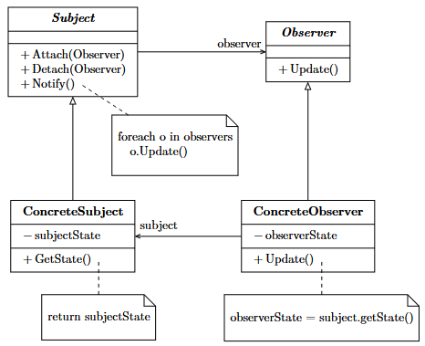
  <figcaption class="fig-caption">Meccanismo di notifica nell'Observer Pattern</figcaption>
</figure>

L'**Observer Pattern** (noto anche come modello *Publish-Subscribe*) definisce una relazione di dipendenza uno-a-molti tra un'entità centrale, definita editore o soggetto, e una moltitudine di moduli esterni dipendenti, denominati osservatori. La finalità del pattern è garantire il disaccoppiamento informativo: non appena l'oggetto principale subisce una variazione di stato rilevante, notifica automaticamente l'evento a tutti gli osservatori registrati, i quali procedono ad aggiornare autonomamente la propria configurazione interna senza che il soggetto debba conoscere l'identità o l'implementazione specifica dei suoi destinatari.

La mappatura delle relazioni in UML organizza il flusso di messaggi mediante quattro moduli chiave:
* **Subject**: è la classe (o interfaccia) di controllo che gestisce l'elenco dinamico degli osservatori registrati ed espone i metodi di sottoscrizione, disiscrizione e invio centralizzato delle notifiche di cambiamento.
* **Observer**: è l'interfaccia standard che fissa il metodo di aggiornamento (tipicamente `update()`) utilizzato dal soggetto per propagare l'evento a runtime.
* **ConcreteSubject**: implementa la logica del *Subject*, custodisce lo stato core dell'applicazione e innesca la catena di notifiche ogni volta che si verifica una mutazione dei dati interni.
* **ConcreteObserver**: rappresenta la classe concreta che implementa l'interfaccia *Observer*. Mantiene un riferimento a *ConcreteSubject* e definisce la specifica strategia di reazione o di rendering visivo da eseguire alla ricezione dell'impulso.

Il vantaggio principale di questo approccio è il drastico disaccoppiamento architetturale ottenuto, in quanto il soggetto interagisce solo con una collezione astratta di interfacce, consentendo l'aggiunta o la rimozione dinamica di osservatori in qualsiasi istante del ciclo di vita del software. Tuttavia, tra gli svantaggi spicca il rischio di impatto sulle prestazioni complessive: se il numero di osservatori è elevato o se le routine di `update()` eseguono operazioni onerose, l'innesco di una notifica può generare colli di bottiglia a cascata. Inoltre, la natura asincrona o automatica delle notifiche può rendere difficoltosa l'attività di tracciamento dei bug in fase di debugging, dal momento che i legami e le dipendenze logiche tra i componenti non sono esplicitati staticamente nel codice ma si determinano dinamicamente a runtime.

```c++
#include <iostream>
#include <string>
#include <vector>
#include <algorithm>
#include <memory>

// Pre-dichiarazione dell'interfaccia Observer
class Observer;

// ==========================================
// 1. COMPONENTE SUBJECT (Interfaccia Astratta)
// ==========================================
/**
 * @brief Interfaccia che definisce le operazioni per gestire l'elenco 
 * degli osservatori (iscrizione, cancellazione e notifica).
 */
class Subject {
public:
    virtual ~Subject() = default;
    virtual void iscrivi(Observer* osservatore) = 0;
    virtual void disiscrivi(Observer* osservatore) = 0;
    virtual void notifica() = 0;
};


// ==========================================
// 2. COMPONENTE OBSERVER (Interfaccia Astratta)
// ==========================================
/**
 * @brief Interfaccia standard che fissa il contratto di aggiornamento per i moduli dipendenti.
 */
class Observer {
public:
    virtual ~Observer() = default;
    // Il metodo riceve lo stato (es. il messaggio) direttamente come parametro (Push Model)
    virtual void update(const std::string& messaggioNotizia) = 0;
};


// ==========================================
// 3. COMPONENTE CONCRETESUBJECT
// ==========================================
/**
 * @brief Custodisce lo stato core (l'ultima notizia) e innesca la catena 
 * di notifiche ad ogni mutazione.
 */
class CanaleNotizieConcreteSubject : public Subject {
private:
    // Elenco dinamico degli osservatori registrati
    std::vector<Observer*> osservatori;
    std::string ultimaNotizia;

public:
    void iscrivi(Observer* osservatore) override {
        osservatori.push_back(osservatore);
    }

    void disiscrivi(Observer* osservatore) override {
        // Rimuove l'osservatore specifico dal vettore
        osservatori.erase(std::remove(osservatori.begin(), osservatori.end(), osservatore), osservatori.end());
    }

    /**
     * @brief Scorrendo la collezione astratta, propaga l'evento a tutti i moduli iscritti.
     */
    void notifica() override {
        for (Observer* osservatore : osservatori) {
            osservatore->update(ultimaNotizia); // Chiamata polimorfica
        }
    }

    /**
     * @brief Metodo di business per pubblicare una nuova notizia.
     */
    void pubblicaNotizia(const std::string& notizia) {
        std::cout << "[Canale Notizie] Pubblicazione editoriale: \"" << notizia << "\"\n";
        ultimaNotizia = notizia;
        // Innesco automatico delle notifiche
        notifica();
    }
};


// ==========================================
// 4. COMPONENTI CONCRETEOBSERVER
// ==========================================
/**
 * @brief Osservatore Concreto A: Rappresenta un'applicazione per Smartphone.
 */
class AppSmartphoneConcreteObserver : public Observer {
private:
    std::string nomeUtente;

public:
    AppSmartphoneConcreteObserver(const std::string& nome) : nomeUtente(nome) {}

    void update(const std::string& messaggioNotizia) override {
        std::cout << " -> [Notifica Push Smartphone per " << nomeUtente 
                  << "]: " << messaggioNotizia << "\n";
    }
};

/**
 * @brief Osservatore Concreto B: Rappresenta un tabellone elettronico stradale.
 */
class TabelloneElettronicoConcreteObserver : public Observer {
public:
    void update(const std::string& messaggioNotizia) override {
        std::cout << " -> [Tabellone Luminoso Led] Aggiornamento flash: " 
                  << messaggioNotizia << "\n";
    }
};


// ==========================================
// 5. COMPONENTE CLIENT
// ==========================================
/**
 * @brief Il Client coordina le iscrizioni a runtime, dimostrando 
 * il disaccoppiamento informativo e la dinamicità del pattern.
 */
int main() {
    std::cout << "--- Inizio esecuzione del programma Client (Observer Pattern) ---\n\n";

    // 1. Creazione del Soggetto centrale
    CanaleNotizieConcreteSubject agenziaStampa;

    // 2. Creazione degli Osservatori (i moduli dipendenti)
    AppSmartphoneConcreteObserver utenteMario("Mario");
    AppSmartphoneConcreteObserver utenteAnna("Anna");
    TabelloneElettronicoConcreteObserver tabelloneCittadino;

    std::cout << "1. Registrazione degli utenti al servizio di notifica...\n";
    agenziaStampa.iscrivi(&utenteMario);
    agenziaStampa.iscrivi(&utenteAnna);
    agenziaStampa.iscrivi(&tabelloneCittadino);

    std::cout << "\n2. Prima trasmissione (Tutti gli osservatori ricevono l'impulso):\n";
    agenziaStampa.pubblicaNotizia("Scoperta acqua liquida su un esopianeta vicino!");

    std::cout << "\n3. Un utente decide di disiscriversi dal servizio a runtime...\n";
    agenziaStampa.disiscrivi(&utenteMario);

    std::cout << "\n4. Seconda trasmissione (Solo i moduli ancora iscritti reagiscono):\n";
    agenziaStampa.pubblicaNotizia("Previsioni meteo: attese forti piogge nel fine settimana.");

    std::cout << "\n--- Fine esecuzione del programma Client ---\n";
    return 0;
}
```

---

### Strategy Pattern

<figure class="fig-float center" style="width: 75%;">
  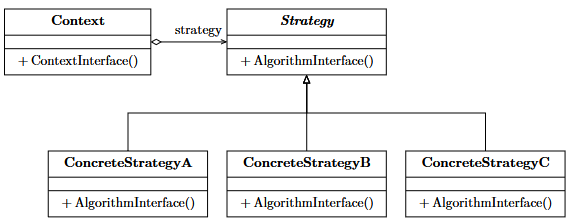
  <figcaption class="fig-caption">Intercambiabilità degli algoritmi tramite Strategy Pattern</figcaption>
</figure>

Lo **Strategy Pattern** (noto anche come *Policy Pattern*) è una soluzione comportamentale orientata alla definizione di una famiglia di algoritmi omogenei, provvedendo a isolarli, incapsularli e renderli interamente intercambiabili tra loro. Il pattern consente di variare dinamicamente la logica esecutiva o il comportamento di un oggetto a runtime in base alle necessità del client o del contesto applicativo, aggirando la necessità di modificare la struttura interna della classe ospite e rispettando fedelmente il principio *Open/Closed* della progettazione del software.

La scomposizione del pattern si articola graficamente su tre elementi essenziali:
* **Context**: è la classe operativa che necessita dell'algoritmo per portare a termine la propria funzionalità di business. Essa non implementa direttamente la computazione, ma mantiene un riferimento astratto all'interfaccia della strategia, delegandone l'esecuzione al modulo iniettato.
* **Strategy**: rappresenta l'interfaccia comune che funge da contratto standard per tutte le varianti algoritmiche supportate dal sistema.
* **ConcreteStrategy**: individua le diverse classi concrete che implementano le specifiche varianti o declinazioni dell'algoritmo (es. differenti algoritmi di ordinamento, di compressione dati o di calcolo delle tariffe).

L'adozione dello Strategy favorisce la pulizia del design architetturale isolando le logiche di calcolo complesse dalle classi di business principali, eliminando la necessità di ricorrere a ridondanti istruzioni condizionali. Permette di estendere il sistema introducendo nuove politiche computazionali in totale sicurezza e facilita i test unitari, poiché ogni singola strategia può essere convalidata in isolamento. Di contro, lo svantaggio principale risiede nella proliferazione del numero di classi all'interno del progetto, fattore che può complicare la configurazione iniziale. Inoltre, sposta sul client l'onere e la responsabilità di conoscere le differenze tra le varie strategie disponibili per poter selezionare e iniettare correttamente l'istanza più idonea al *Context*, introducendo una complessità decisionale esterna al nucleo del pattern.

```c++
#include <iostream>
#include <memory>
#include <vector>

// ==========================================
// 1. COMPONENTE STRATEGY (Interfaccia Astratta)
// ==========================================
/**
 * @brief Interfaccia comune per tutte le varianti algoritmiche di calcolo del prezzo.
 */
class StrategiaPrezzo {
public:
    virtual ~StrategiaPrezzo() = default;
    // Metodo polimorfo che incapsula l'algoritmo intercambiabile
    virtual double calcolaTotale(double prezzoGrezzo) const = 0;
};


// ==========================================
// 2. COMPONENTI CONCRETESTRATEGY
// ==========================================
/**
 * @brief Strategia Concreta A: Nessuna scontistica applicata (Algoritmo standard).
 */
class StrategiaPrezzoNormale : public StrategiaPrezzo {
public:
    double calcolaTotale(double prezzoGrezzo) const override {
        return prezzoGrezzo; // Nessuna variazione
    }
};

/**
 * @brief Strategia Concreta B: Applica uno sconto flat del 20% (Algoritmo promozionale).
 */
class StrategiaScontoBlackFriday : public StrategiaPrezzo {
public:
    double calcolaTotale(double prezzoGrezzo) const override {
        std::cout << "[Strategy: Black Friday] -> Applicazione dello sconto del 20%.\n";
        return prezzoGrezzo * 0.80;
    }
};

/**
 * @brief Strategia Concreta C: Applica uno sconto fedeltà del 50% (Algoritmo speciale).
 */
class StrategiaScontoVip : public StrategiaPrezzo {
public:
    double calcolaTotale(double prezzoGrezzo) const override {
        std::cout << "[Strategy: Clienti VIP] -> Applicazione dello sconto speciale del 50%.\n";
        return prezzoGrezzo * 0.50;
    }
};


// ==========================================
// 3. COMPONENTE CONTEXT
// ==========================================
/**
 * @brief La classe operativa che richiede l'algoritmo per completare il suo compito.
 * Mantiene un riferimento astratto alla strategia senza conoscerne i dettagli.
 */
class CalcolatoreSpesaContext {
private:
    // Riferimento polimorfo all'interfaccia dell'algoritmo
    std::unique_ptr<StrategiaPrezzo> strategiaCorrente;
    double importoBase = 0.0;

public:
    // Iniettiamo la strategia iniziale tramite costruttore (Dependency Injection)
    CalcolatoreSpesaContext(std::unique_ptr<StrategiaPrezzo> strat) 
        : strategiaCorrente(std::move(strat)) {}

    /**
     * @brief Permette al client di variare dinamicamente l'algoritmo a runtime.
     */
    void impostaStrategia(std::unique_ptr<StrategiaPrezzo> nuovaStrat) {
        strategiaCorrente = std::move(nuovaStrat);
    }

    void aggiungiArticolo(double prezzo) {
        importoBase += prezzo;
    }

    /**
     * @brief Delega la computazione complessa alla strategia correntemente iniettata.
     */
    void calcolaEStampaPrezzoFinale() const {
        std::cout << "[Context] Importo base accumulato: " << importoBase << " Euro\n";
        
        // Esecuzione polimorfa dell'algoritmo incapsulato
        double prezzoFinale = strategiaCorrente->calcolaTotale(importoBase);
        
        std::cout << "[Context] Prezzo finale da pagare all'estratto conto: " << prezzoFinale << " Euro\n";
    }
};


// ==========================================
// 4. COMPONENTE CLIENT
// ==========================================
/**
 * @brief Il Client sceglie ed istanzia le strategie specifiche, 
 * assumendosi l'onere di configurare il Context a seconda delle esigenze di runtime.
 */
int main() {
    std::cout << "--- Inizio esecuzione del programma Client (Strategy Pattern) ---\n\n";

    std::cout << "1. Creazione del carrello con configurazione di base (Nessuno Sconto):\n";
    // Il client seleziona e inietta la strategia iniziale
    CalcolatoreSpesaContext carrello(std::make_unique<StrategiaPrezzoNormale>());
    carrello.aggiungiArticolo(50.0);
    carrello.aggiungiArticolo(150.0);
    carrello.calcolaEStampaPrezzoFinale();

    std::cout << "\n2. Cambiamento dinamico delle regole di business (Attivazione Black Friday):\n";
    // Il client decide a runtime di sostituire l'algoritmo nel contesto
    carrello.impostaStrategia(std::make_unique<StrategiaScontoBlackFriday>());
    carrello.calcolaEStampaPrezzoFinale();

    std::cout << "\n3. Cambiamento dinamico delle regole di business (Riconoscimento Utente VIP):\n";
    // Il contesto applica una terza variante computazionale in totale trasparenza
    carrello.impostaStrategia(std::make_unique<StrategiaScontoVip>());
    carrello.calcolaEStampaPrezzoFinale();

    std::cout << "\n--- Fine esecuzione del programma Client ---\n";
    return 0;
}
```