# UML Diagrams

## Panoramica dei Diagrammi UML
Il linguaggio UML utilizza elementi grafici interconnessi per offrire molteplici viste dello stesso sistema, tutte correlate tra loro. Questa complessità viene organizzata dividendo l'intera specifica in due grandi famiglie di diagrammi:

* **Diagrammi Strutturali**: Fotografano l'architettura statica del sistema. Mostrano quali elementi compongono il software (classi, oggetti, componenti, hardware) e come sono legati tra loro dal punto di vista logico e fisico.
* **Diagrammi Comportamentali**: Descrivono la natura dinamica del sistema. Mostrano come il software evolve nel tempo, come cambiano gli stati degli oggetti e in che modo questi comunicano tra loro per eseguire un'azione.

<figure class="fig-float center" style="width: 60%;">
  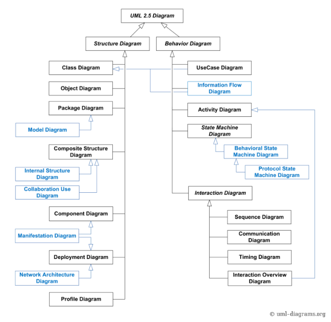
  <figcaption class="fig-caption">Panoramica della famiglia di diagrammi UML</figcaption>
</figure>

Sebbene lo standard UML ufficiale preveda più di una dozzina di diagrammi, nella pratica quotidiana dello sviluppo software ne vengono utilizzati principalmente nove, ripartiti tra le due famiglie. Per i diagrammi strutturali che forniscono una visione statica del sistema si usano:

- **Class Diagram**: Il pilastro di UML. Mostra la struttura del sistema definendo le classi, i loro attributi, i metodi e le relazioni tra di esse.
- **Object Diagram**: rappresenta le istanze delle classi. A differenza del Class Diagram, mostra oggetti concreti con valori assegnati agli attributi.
- **Component Diagram**: descrive i componenti software e le loro dipendenze all’interno del sistema.
- **Deployment Diagram**: rappresenta la distribuzione fisica del sistema sull’hardware.

Per i diagrammi strutturali che forniscono una visione dinamica del sistema si usano:
- **Use Case Diagram**: descrive il comportamento del sistema dal punto di vista dell’utente. È utile per comprendere i requisiti e le interazioni tra sistema e attori esterni.
- **Activity Diagram**: rappresenta il flusso delle attività all’interno di un processo o di un use case.
- **State Diagram**: rappresenta gli stati di un sistema e le transizioni tra essi. Include uno stato iniziale e uno stato finale.
- **Sequence Diagram**: descrive le interazioni tra oggetti nel tempo, evidenziando l’ordine delle comunicazioni.
- **Communication Diagram** (ex Collaboration Diagram): mostra la cooperazione tra oggetti e come collaborano per realizzare un comportamento.

È bene chiarire che non sempre sarà necessario lo sviluppo di tutti e nove i diagrammi, la loro definizione infatti dipende esclusivamente dal contesto sempre con lo scopo di rendere comprensibile il progetto a tutte le parti in causa. Ad esempio, un commerciale non trarrà una particolare impressione leggendo un Class Diagram ma potrà, certamente, avere le idee più chiare analizzando uno Use Case Diagram.

## Class Diagram

Il **Class Diagram** fornisce una rappresentazione delle classi e delle relazioni che intercorrono tra esse. Questo tipo di diagramma UML viene impiegato principalmente per la fase di analisi e progettazione della struttura statica dell'applicazione, descrivere le responsabilità del sistema e abilitare all'engineering diretto o inverso. 

<figure class="fig-float center" style="width: 35%;">
  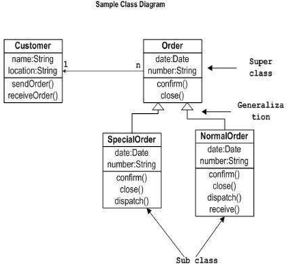
  <figcaption class="fig-caption">Esempio di class diagram</figcaption>
</figure>

Questo diagramma è composto da due principali elementi, di cui andremo ad analizzare i dettagli nei seguenti sotto-paragrafi:
* Classi
* Relazioni

### Classi UML

<figure class="fig-float right" style="width: 35%;">
  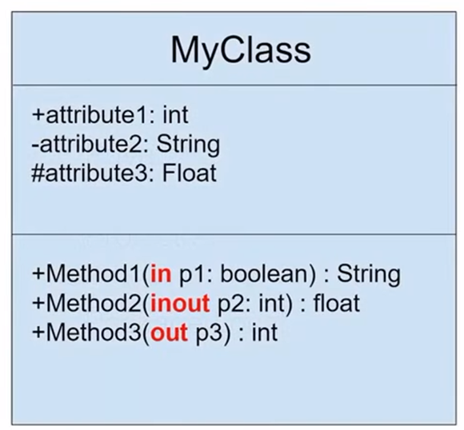
  <figcaption class="fig-caption">Classe UML</figcaption>
</figure>

Una **Classe** è una struttura dati che descrive oggetti con caratteristiche simili ed è rappresentata in UML con un rettangolo composto da tre sezioni:

* **Sezione del Nome**: contiene il nome della classe, il quale per convenzione deve essere al singolare e tutte le parole che lo compongono iniziano con la maiuscola.
* **Sezione degli Attributi**: gli attributi sono le proprietà della classe e il formato generale (obbligatori sono visibilità, nome e tipo) è:
  *visibilità nome: tipo [molteplicità] = valoreIniziale {proprietà}*
* **Sezione delle Operazioni**: le operazioni sono i metodi che la classe offre e il formato generale (obbligatori sono visibilità, nome e tipo di ritorno) è:
  *visibilità nome (listaParametri) : tipoRitorno*

Convenzione specifica per gli attributi e le operazioni *statiche* che devono essere sottolineate. 

La visibilità in UML, così come in C++, stabilisce il livello di accessibilità all'attributo o operazione della classe e ciascun livello ha uno specifico simbolo:

* **Livello Pubblico**: indicato con il simbolo `+` che specifica l'accesso all'attributo o metodo esternamente alla classe.
* **Livello Protetto**: indicato con il simbolo `#` che specifica l'accesso soltanto alle classi derivate da quella originale.
* **Livello Privato**: indicato con il simbolo `-` che specifica che solo la classe originale può avere accesso a quell'attributo o metodo.
* **Livello Package**: indicato con il simbolo `~` che specifica che solo gli elementi dello stesso package possono avere accesso a quell'attributo o metodo.

### Relazioni Tra Classi
Le **Relazioni** tra le classi stabiliscono i legami che intercorrono tra di esse. Nel Class Diagram vengono descritte solo le *relazioni statiche*, ovvero quelle che non cambiano nel tempo. In UML tali relazioni vengono classificate come segue:

<figure class="fig-float right" style="width: 35%;">
  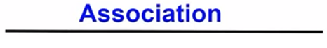
  <figcaption class="fig-caption">Simbolo associazione</figcaption>
</figure>

* **Associazione**: rappresenta una relazione logica tra due classi.
  
  <figure class="fig-float center" style="width: 50%;">
    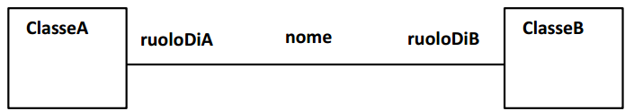
    <figcaption class="fig-caption">UML Associazione</figcaption>
  </figure>

  Generalmente è necessario che sia presente il nome dell'associazione, nel caso dell'esempio "lavoraIn", oppure i ruoli delle due classi, nel caso dell'esempio "impiegato" e "datore di lavoro".
  
  <figure class="fig-float center" style="width: 50%;">
    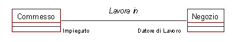
    <figcaption class="fig-caption">UML Associazione Example</figcaption>
  </figure>

  Altro aspetto fondamentale è la molteplicità di associazione, la quale indica il numero di oggetti coinvolti nell'associazione *in un dato istante*. Tale informazione viene collocata vicino alla classe, per esempio `1`, `0..1`, `0..*`, `1..*`, `3..6` dove l'asterisco `*` indica il concetto di "molti".
  
  <figure class="fig-float center" style="width: 50%;">
    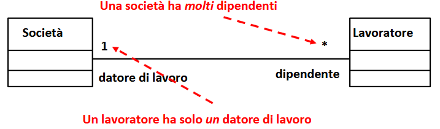
    <figcaption class="fig-caption">UML Associazione Molteplicità</figcaption>
  </figure>

  In questi contesti può capitare la presenza di **Associazioni Riflessive**, ovvero quando una classe è associata con se stessa. Un esempio è un dipendente che supervisiona altri dipendenti.
  
  <figure class="fig-float center" style="width: 50%;">
    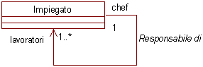
    <figcaption class="fig-caption">UML Associazione Riflessiva</figcaption>
  </figure>

  In taluni casi l'associazione stessa può essere essa stessa una classe. La **Classe Associazione** è una associazione dotata di propri attributi e viene rappresentata collegando quest'ultima con una linea tratteggiata alla linea continua dell'associazione. Nell'esempio in figura la regola è che ogni Persona che ha una Posizione lavorativa in una Azienda percepisce uno stipendio. Lo stipendio in questo caso sarà un attributo della classe associazione Posizione (lavorativa).
  
  <figure class="fig-float center" style="width: 50%;">
    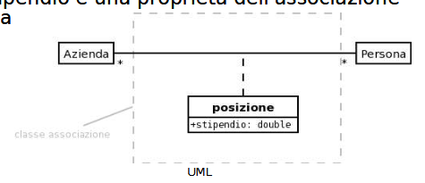
    <figcaption class="fig-caption">UML Classe Associazione</figcaption>
  </figure>

  Così come gli oggetti sono le istanze delle classi, analogamente i "collegamenti", ovvero le relazioni degli Object Diagram che si vedranno di seguito, sono di fatto delle istanze delle associazioni del Class Diagram. È bene specificare che si può impiegare una classe associazione solo quando il collegamento che ne fa da istanza ha una *identità univoca*.

<figure class="fig-float right" style="width: 35%;">
  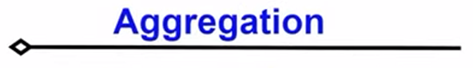
  <figcaption class="fig-caption">Simbolo aggregazione</figcaption>
</figure>

* **Aggregazione**: descrive una relazione del tipo "parte-intero", ovvero quella in cui una classe che rappresenta l'"intero" è costituita da più classi che la compongono. Un'aggregazione è rappresentata come una gerarchia in cui l'"intero" si trova in cima e i componenti ("parte") al di sotto. Il collegamento viene effettuato mediante una linea che parte dalla classe "componente" e termina con un rombo vuoto sulla classe "intero". Si indica inoltre in prossimità dell'elemento "parte" l'occorrenza di quest'ultimo (2 volte, 3, ecc.). Nell'esempio in figura l'intero è rappresentato dalla TV e seguono i suoi componenti, alcuni dei quali come i circuiti integrati si possono ulteriormente trovare per esempio nel telecomando.

<figure class="fig-float center" style="width: 50%;">
  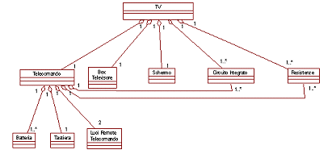
  <figcaption class="fig-caption">UML Aggregazione</figcaption>
</figure>

<figure class="fig-float right" style="width: 35%;">
  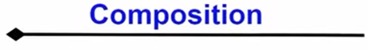
  <figcaption class="fig-caption">Simbolo composizione</figcaption>
</figure>

* **Composizione**: è la versione più forte di aggregazione in cui ogni componente può appartenere soltanto ad un "intero" (non è il caso dell'esempio precedente visto che il circuito integrato si trova sia nella TV che nella sua componente telecomando). Il simbolo utilizzato per una composizione è lo stesso utilizzato per un'aggregazione eccetto il fatto che il rombo è colorato di nero. Nell'esempio in figura ogni parte del corpo umano può appartenere soltanto all'intero corpo e non anche a delle sue componenti.

<figure class="fig-float center" style="width: 50%;">
  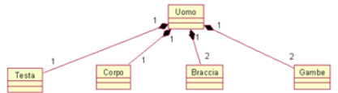
  <figcaption class="fig-caption">UML Composizione</figcaption>
</figure>

<figure class="fig-float right" style="width: 35%;">
  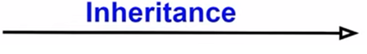
  <figcaption class="fig-caption">Simbolo ereditarietà</figcaption>
</figure>

* **Generalizzazione (o Ereditarietà)**: relazione "is-a" che rappresenta ereditarietà tra una superclasse e una sottoclasse. Rappresentata in UML tramite una freccia che parte dalla classe derivata e punta verso la classe originale. Una classe generica, ad esempio la classe "animale", avrà una certa gamma di attributi e metodi che potranno essere ereditati dalle sue classi derivate, in questo caso "rettili, anfibi, mammiferi, ecc.". È buona norma *evitare gerarchie troppo profonde* (più di tre livelli). Le **Classi Astratte** sono classi che non permettono di istanziare nessun tipo di oggetto e si indicano in UML con il suo nome in corsivo. Motivo per cui le classi astratte sono utilizzate soltanto como classi base per l'ereditarietà e non forniscono alcun oggetto implementabile.

<figure class="fig-float center" style="width: 50%;">
  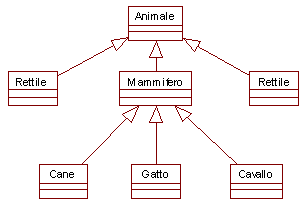
  <figcaption class="fig-caption">UML Ereditarietà</figcaption>
</figure>

<figure class="fig-float right" style="width: 35%;">
  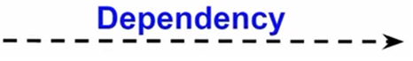
  <figcaption class="fig-caption">Simbolo dipendenza</figcaption>
</figure>

* **Dipendenza**: una relazione debole tra due classi, in cui una classe dipende dall'altra per funzionare (ad esempio, un metodo usa un'istanza di un'altra classe). Viene rappresentata da una freccia tratteggiata che punta alla classe da cui si dipende. Il tipico esempio è il cliente e il fornitore.

<figure class="fig-float center" style="width: 50%;">
  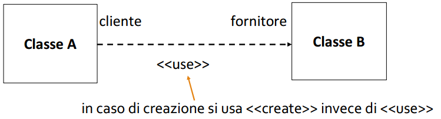
  <figcaption class="fig-caption">UML Class Diagram Dependence</figcaption>
</figure>

<figure class="fig-float right" style="width: 35%;">
  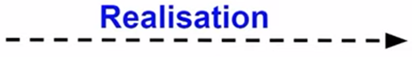
  <figcaption class="fig-caption">Simbolo realizzazione</figcaption>
</figure>

* **Realizzazione**: relazione tra una classe concreta e un'interfaccia che essa implementa. Quando si definiscono le classi di un sistema software, basandosi sui requisiti raccolti tramite interviste con il cliente, è importante stabilire le relazioni tra di esse. Tuttavia, possono esistere classi che condividono comportamenti comuni senza avere una relazione gerarchica con una classe padre. In questi casi, si utilizza il concetto di interfaccia. Un'**Interfaccia** rappresenta un insieme di operazioni che specificano aspetti del comportamento di una classe e che possono essere offerte ad altre classi. A differenza delle classi, le interfacce non possiedono attributi, ma solo metodi (operazioni). In UML, l'interfaccia presenta la simbologia analoga alla classe però sul nome è presente la dicitura `«interface»`, mentre per collegare la classe normale e l'interfaccia si usa una linea tratteggiata che termina con un triangolo vuoto che punta sull'interfaccia. Un esempio pratico è la tastiera del computer, che funziona come un'interfaccia riutilizzabile. La pressione di un tasto (operazione "KeyStroke") è stata trasferita dal sistema della macchina da scrivere al computer. Sebbene la disposizione dei tasti sia simile, il computer offre anche nuove operazioni non presenti sulla macchina da scrivere, come "Ctrl", "Alt", o "PageUp". Le interfacce sono quindi fondamentali per definire comportamenti riutilizzabili e per strutturare sistemi software in modo modulare e flessibile.

<figure class="fig-float center" style="width: 50%;">
  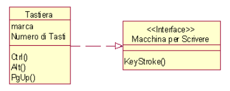
  <figcaption class="fig-caption">Interfaccia UML</figcaption>
</figure>

## Object Diagram

L'**Object Diagram** fornisce una rappresentazione degli oggetti, intesi come istanze concrete delle classi, e delle relative relazioni descritte nel Class Diagram. Analogamente al Class Diagram, l'Object Diagram mostra una visione statica della struttura dell'applicazione, ma focalizzandosi su uno specifico istante di tempo a runtime in cui a tutti gli attributi è assegnato un valore reale.

Similmente al Class Diagram, gli elementi costituenti questo diagramma sono:

<figure class="fig-float right" style="width: 40%;">
  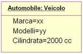
  <figcaption class="fig-caption">Oggetto in un object diagram</figcaption>
</figure>

* **Oggetti**: rappresentano una classe nel momento in cui viene istanziata e i suoi attributi vengono assegnati. Un oggetto è composto da due sezioni:
  - **Sezione del Nome**: contiene il nome dell'oggetto (istanza) seguito da ":" e dal nome della classe di appartenenza (nella sintassi `nomeOggetto : NomeClasse`); l'intera stringa deve essere obbligatoriamente sottolineata.
  - **Sezione degli Attributi**: contiene l'elenco delle proprietà dell'oggetto di cui viene esplicitato il valore attuale. Sebbene sia possibile includere anche il tipo di dato, quest'ultimo viene solitamente omesso poiché risulterebbe ridondante rispetto a quanto già definito nel Class Diagram.
* **Relazioni**: rappresentano le istanze reali dei legami visti nel Class Diagram. In questo caso, però, prendono il nome di **Collegamenti** (o *Link*), non possiedono un nome proprio e la loro molteplicità è implicitamente sempre 1 a 1. 

Nella seguente figura è mostrato un esempio che evidenzia le differenze strutturali e sintattiche tra un Class Diagram (a sinistra) e il rispettivo Object Diagram a runtime (a destra).

<figure class="fig-float center" style="width: 80%;">
  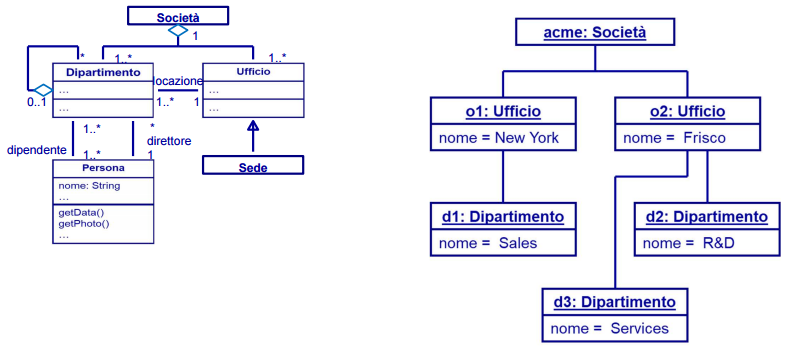
  <figcaption class="fig-caption">Esempio di object diagram</figcaption>
</figure>
## Component Diagram
Il **Component Diagram** è un diagramma UML che rappresenta i componenti fisici di un sistema (file, librerie, eseguibili, moduli, pacchetti, database, ecc.) e le loro relazioni. Questo tipo di diagramma, contrariamente ad altri che descrivono entità concettuali, questo diagramma viene impiopagato per visualizzare l'architettura fisica del sistema, compito fondamentale sia per il cliente che vedere il risultato finale che per gli sviluppatori come base di lavoro e strumento di supporto all'implementazione. Questo diagramma utilizza

* **Deployment Components**: elementi eseguibili come DLL, file eseguibili, controlli ActiveX o JavaBeans, che costituiscono la base del sistema operativo.
* **Work Product Components**: file sorgenti o dati utilizzati per creare i deployment components.
* **Execution Components**: prodotti finali generati dall’esecuzione del sistema.

Infine, un componente può accedere ai servizi di un altro tramite un’interfaccia di *import*, mentre quello che fornisce i servizi lo fa attraverso un’interfaccia di *export*. Questo schema facilita l’interazione e il riutilizzo dei componenti all’interno del sistema.

<figure class="fig-float center" style="width: 40%;">
  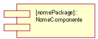
  <figcaption class="fig-caption">UML Component</figcaption>
</figure>

Il collegamento tra un componente e una interfaccia può essere rappresentato in due modi:

* **A. Freccia tratteggiata e riquadro per l'interfaccia**

<figure class="fig-float center" style="width: 40%;">
  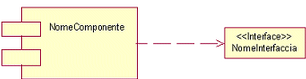
  <figcaption class="fig-caption">UML Component Interface 1</figcaption>
</figure>

* **B. Freccia tratteggiata e cerchi per l'interfaccia**

<figure class="fig-float center" style="width: 40%;">
  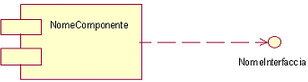
  <figcaption class="fig-caption">UML Component Interface 2</figcaption>
</figure>

Supponiamo per esempio di voler realizzare un software per ascoltare musica registrata su un CD-ROM. Si potrebbe pensare di realizzare la GUI in figura che, come indicato dai pulsanti, necessita di appropriati componenti per implementarne la loro funzionalità. Si ottiene perciò come risultato il diagramma a destra relativo ai diversi pulsanti.

<figure class="fig-float center" style="width: 40%;">
  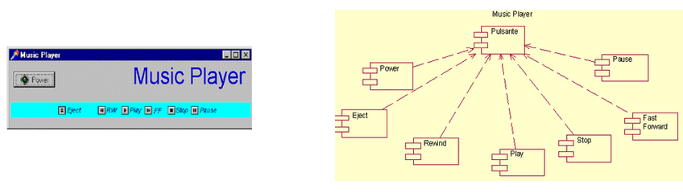
  <figcaption class="fig-caption">Esempio di component diagram<figcaption>
</figure>

## Deployment Diagram

Il **Deployment Diagram** ha lo scopo di rappresentare la distribuzione fisica dei componenti software sull'infrastruttura hardware. Grazie a questo diagramma è possibile visualizzare dove vengono eseguiti i diversi moduli del sistema e analizzare aspetti non funzionali quali prestazioni, scalabilità, manutenibilità e portabilità. A differenza del *Component Diagram*, che descrive come il software è organizzato e quali sono le relazioni logiche tra i suoi moduli, il Deployment Diagram mostra dove tali elementi vengono eseguiti fisicamente, evidenziando i nodi hardware e le connessioni di rete tra essi. In effetti, può essere inteso come una variante del Class Diagram focalizzata sulla struttura fisica e architetturale del sistema.

<figure class="fig-float center" style="width: 80%;">
  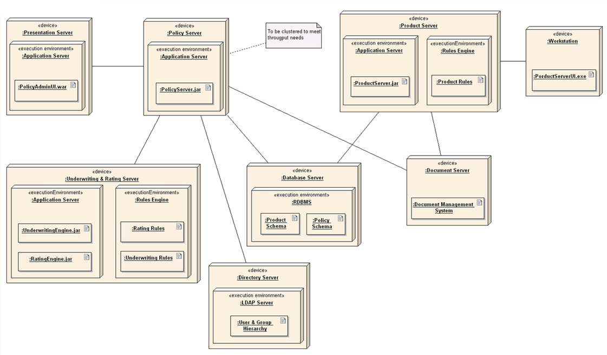
  <figcaption class="fig-caption">Esempio 1 di deployment diagram</figcaption>
</figure>

In questo diagramma sono presenti degli elementi costitutivi principali, identificabili tramite icone e stereotipi dedicati:

<figure class="fig-float center" style="width: 80%;">
  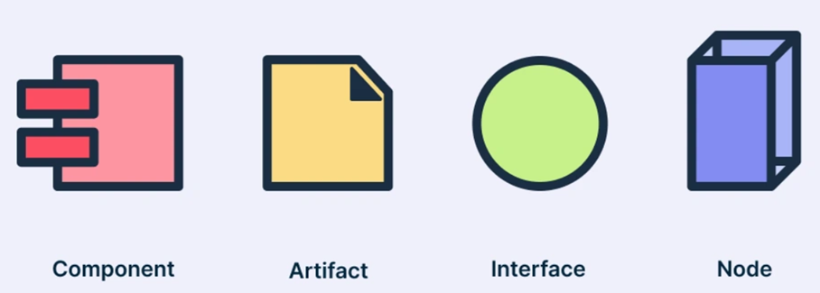
  <figcaption class="fig-caption">Icone dei componenti logici e fisici in UML</figcaption>
</figure>

* **Nodo**: rappresentato graficamente come una scatola (un cubo tridimensionale), esso è associato a differenti tipologie di risorsa contrassegnate con la notazione stereotipata `«tipologia_di_risorsa»`:
  - **Processor**: un nodo computazionale in grado di eseguire componenti software.
  - **Device**: un nodo hardware che interagisce con il mondo esterno ma che, generalmente, non esegue direttamente componenti software (es. periferiche).
  - **Execution Environment**: un nodo di tipo software che gira all'interno di un hardware e ospita l'applicazione (es. una JVM, un container o un web server).

<figure class="fig-float center" style="width: 50%;">
  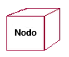
  <figcaption class="fig-caption">Nodo</figcaption>
</figure>

* **Componente**: rappresenta l'unità modulare e logica del sistema software (la struttura concettuale).
* **Artefatto**: rappresenta la manifestazione fisica del software (es. un file `.exe`, `.jar` o uno schema di database). È l'elemento concreto (il file) che racchiude i componenti logici e viene effettivamente installato all'interno di un nodo.
* **Interfaccia**: rappresentata graficamente come un piccolo cerchio (notazione a *lollipop*), definisce il punto di contatto logico, ovvero l'insieme di servizi e API che un artefatto o un nodo espone (interfaccia fornita) o di cui ha bisogno (interfaccia richiesta) per comunicare con gli altri elementi.
* **Associazioni**: sono gli archi (linee continue) che collegano tra loro i nodi per creare relazioni di dipendenza. Come i nodi, anche gli archi possono essere contrassegnati con uno stereotipo del tipo `«tipologia_di_associazione»` per indicare lo specifico canale fisico o protocollo di rete utilizzato (es. `«TCP/IP»` o `«HTTP»`) che permette il passaggio dei dati attraverso le interfacce.

Nella figura seguente il nodo principale è rappresentato dalla CPU, che ospita diversi componenti software collegati tra loro mediante opportune relazioni. Gli altri elementi hardware presenti sono dispositivi (*devices*) connessi all'unità centrale. Questo diagramma può essere esteso aggiungendo, ad esempio, un modem e una connessione a Internet, mostrando come il sistema comunichi con l'esterno. Tale estensione evidenzia la versatilità dei Deployment Diagram nella modellazione di reti di calcolatori e sistemi distribuiti.

<figure class="fig-float center" style="width: 80%;">
  
  <figcaption class="fig-caption">Esempio 2 di deployment diagram</figcaption>
</figure>

## Use Case Diagram

Il **Use Case Diagram** (Diagramma dei Casi d'Uso) rappresenta le funzionalità di un sistema dal punto di vista degli utenti o di altre entità esterne che interagiscono con esso. Tramite questo diagramma è possibile raccogliere, analizzare e definire i requisiti funzionali, stabilendo *cosa* il sistema deve fare, ma senza specificare *come* debba farlo. 

Gli elementi costituenti questo diagramma sono:
* **Attori (Actors)**: rappresentano le entità esterne (utenti umani, altri sistemi software o dispositivi hardware) che interagiscono con il sistema, avviando una sequenza di eventi o ricevendone un risultato. Graficamente sono rappresentati tramite uno stilizzato "stick man".
* **Casi d'Uso (Use Cases)**: descrivono le singole funzionalità o sequenze di azioni coerenti offerte dal sistema. Sono schematizzati tramite un'ellisse contenente una breve descrizione verbale.
* **Relazioni**: 
  - **Inclusione (Inclusion)**: permette di fattorizzare una sequenza di passi comune, inglobandola all'interno di un altro caso d'uso che ne ha bisogno per completare il proprio compito. Viene rappresentata con una linea tratteggiata dotata di una freccia che punta verso il caso d'uso incluso, accompagnata dallo stereotipo `«include»`.
  - **Estensione (Extension)**: consente di aggiungere passi opzionali o condizionali a un caso d'uso esistente (detto caso d'uso base) senza modificarlo direttamente. Viene rappresentata con una linea tratteggiata dotata di una freccia che punta verso il caso d'uso base, accompagnata dallo stereotipo `«extend»`. All'interno del caso d'uso base è possibile specificare il punto di estensione (*extension point*).
  - **Generalizzazione (Generalization)**: esprime una relazione di ereditarietà ("is-a") in cui un caso d'uso figlio eredita il comportamento e il significato dal padre, aggiungendo caratteristiche specifiche. Lo stesso principio si applica anche agli attori. Viene rappresentata graficamente tramite una linea continua che termina con una freccia a triangolo vuoto che punta verso l'elemento padre.
  - **Raggruppamento (Grouping)**: utilizzato nei sistemi complessi composti da più sottosistemi per organizzare logicamente i casi d'uso correlati, migliorando la leggibilità del diagramma (spesso delimitandoli visivamente tramite un confine di sistema o *system boundary*).

<figure class="fig-float center" style="width: 80%;">
  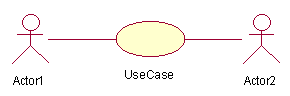
  <figcaption class="fig-caption">Elementi principali di un Use Case Diagram</figcaption>
</figure>

### Esempio Pratico: Macchina Self-Service

Per comprendere l'applicazione di questi concetti, si consideri la modellazione di una macchina self-service per alimenti e bevande. La principale funzione del sistema è permettere all'utente l'acquisto di uno snack o di una bibita. Di conseguenza, il caso d'uso principale viene identificato come "Acquisto di un prodotto".

<figure class="fig-float center" style="width: 50%;">
  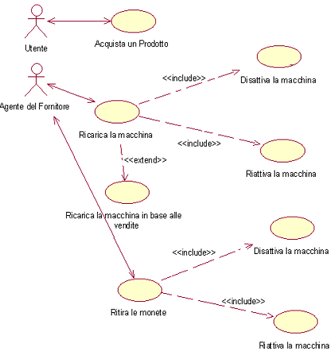
  <figcaption class="fig-caption">Caso d'uso base per la macchina self-service</figcaption>
</figure>

Nel diagramma completo, la relazione di **generalizzazione** viene impiegata per specializzare il ruolo del personale di servizio, distinguendo tra il "Proprietario" (addetto al ritiro delle monete) e il "Fornitore" (addetto alla ricarica dei prodotti) a partire da un attore generico.

<figure class="fig-float center" style="width: 60%;">
  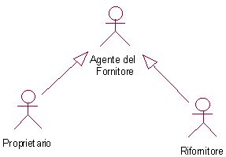
  <figcaption class="fig-caption">Applicazione della generalizzazione tra attori</figcaption>
</figure>

Infine, vengono introdotte le relazioni di **inclusione** ed **estensione**: l'operazione di ricarica dei prodotti include necessariamente lo sblocco e la manutenzione interna dei cestelli ("Disattivare/Riattivare la macchina"), mentre la generazione di un report di inventario estende il flusso principale in modo condizionale solo in base al volume delle vendite registrate.

<figure class="fig-float center" style="width: 70%;">
  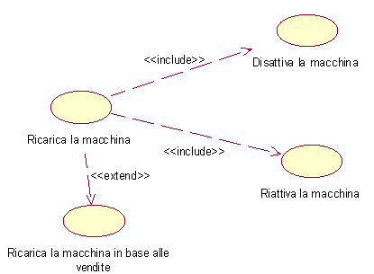
  <figcaption class="fig-caption">Esempio di relazioni include ed extend nel sistema</figcaption>
</figure>

## Activity Diagram

<figure class="fig-float right" style="width: 35%;">
  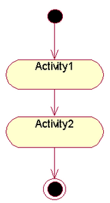
  <figcaption class="fig-caption">Activity Diagram UML</figcaption>
</figure>

L'**Activity Diagram** (Diagramma delle Attività) rappresenta gli aspetti dinamici di un sistema, modellando nello specifico il flusso di lavoro sotto forma di sequenze di operazioni sequenziali, parallele o condizionate. Più in generale, consente di descrivere processi di business e fornire una visione architetturale ad alto livello delle funzionalità del sistema.

Di fatto, questo diagramma può essere considerato un’evoluzione o un’estensione dello *State Diagram* (Diagramma degli Stati), in cui l’enfasi viene posta sulle attività e sul loro svolgimento logico piuttosto che sui singoli stati delle entità.

Il diagramma è composto principalmente dai seguenti elementi costitutivi:

* **Attività**: rappresentano le singole azioni o unità di lavoro computazionale eseguite dal sistema. Graficamente sono schematizzate come rettangoli con i bordi arrotondati.
* **Flussi di Controllo (Transizioni)**: rappresentati da frecce orientate, indicano il passaggio da un'attività a quella successiva al termine dell'azione precedente. Il flusso può evolvere in modo:
  - *Sequenziale*: un'attività segue l'altra in ordine cronologico diretto.
  - *Condizionale*: il percorso si ramifica in base al soddisfacimento di specifiche clausole.
  - *Parallelo*: più attività vengono avviate o coordinate simultaneamente in modalità concorrente.
* **Nodi di Decisione e Unione (Merge)**: rappresentati da un rombo, consentono di deviare il flusso su percorsi alternativi in base a condizioni di guardia (espresse tra parentesi quadre, es. `[condizione]`) o di riunificare i rami condizionali precedentemente aperti.
* **Nodi di Fork e Join**: rappresentati graficamente come barre orizzontali o verticali piene. Il *Fork* permette di dividere un singolo flusso in più attività parallele concorrenti, mentre il *Join* sincronizza i flussi paralleli originati dal fork, richiedendo che tutte le attività in ingresso siano completate prima di procedere.

Il diagramma possiede inoltre un punto di ingresso e uno di uscita obbligatori per definire il ciclo di vita del processo: un **nodo iniziale**, rappresentato da un cerchio nero pieno, e uno o più **nodi finali**, rappresentati da un cerchio con bordo doppio (occhio di bue).

I seguenti esempi mostrano due scenari tipici di modellazione UML: a sinistra un flusso decisionale ramificato (struttura if-else tramite nodi di decisione) e a destra un flusso concorrente asincrono gestito mediante nodi di fork e join.

<figure class="fig-float center" style="width: 80%;">
  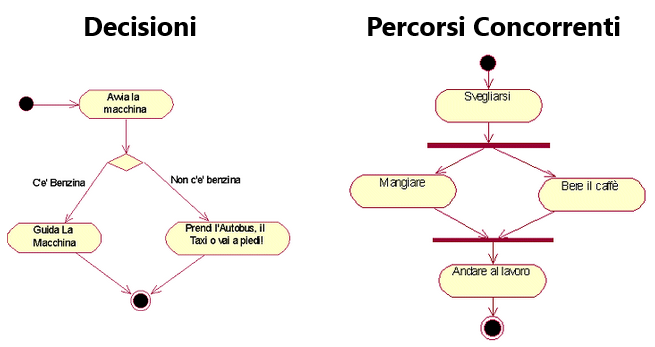
  <figcaption class="fig-caption">Scenari tipici di flussi condizionali e paralleli</figcaption>
</figure>

## State Diagram

Lo **State Diagram** (Diagramma degli Stati) descrive il comportamento dinamico di un sistema focalizzandosi sui cambiamenti di stato che un singolo oggetto subisce nel tempo in risposta agli stimoli. Insieme all'Activity Diagram, fa parte dei modelli UML utilizzati per descrivere gli aspetti comportamentali dell'applicazione. 

L'uso principale consiste nel modellare i **sistemi reattivi**, ovvero quei sistemi il cui comportamento è guidato da eventi interni o esterni. Risulta fondamentale per mappare l'intero ciclo di vita di un elemento, dalla sua creazione fino alla distruzione, facilitando la generazione automatica del codice (*forward engineering*) e la comprensione di sistemi preesistenti (*reverse engineering*).

Il diagramma si basa su tre elementi costitutivi fondamentali:
* **Stati**: rappresentano le condizioni specifiche in cui un oggetto si trova in un determinato intervallo di tempo. Graficamente sono schematizzati come rettangoli con angoli arrotondati contenenti il nome dello stato ed, eventualmente, variabili interne (timer, contatori) o attività associate.
* **Eventi**: i fattori scatenanti (stimoli, chiamate di metodi o scadenze temporali) che causano il cambiamento di stato.
* **Transizioni**: i passaggi orientati, rappresentati da frecce, che spostano l'oggetto da uno stato di origine a uno di destinazione in seguito al verificarsi di un evento.

Come per l'Activity Diagram, il punto di ingresso del ciclo di vita è indicato da un **nodo iniziale** (un cerchio nero pieno), mentre la conclusione è definita da uno o più **nodi finali** (un cerchio con bordo doppio).

<figure class="fig-float center" style="width: 60%;">
  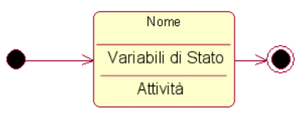
  <figcaption class="fig-caption">Elementi di base e sintassi di uno State Diagram</figcaption>
</figure>

Gli stati possono essere strutturati gerarchicamente: uno **Stato Composto** può contenere al suo interno dei **Sottostati (Substates)**, i quali possono essere *sequenziali* (disgiunti) o *concorrenti* (eseguiti in parallelo in regioni separate da una linea tratteggiata). In questo contesto, il simbolo di una **"H" cerchiata** rappresenta lo stato di **History** (Memoria): indica che, se il sistema viene interrotto e successivamente ritorna in quello stato composto, deve riprendere l'ultimo sottostato che era attivo prima dell'interruzione, anziché ripartire dal sottostato iniziale standard.

Le transizioni possono essere configurate secondo differenti modalità sintattiche:
* **Triggered Transition**: la transizione classica che richiede un evento esplicito (il *trigger*) per attivarsi. Può includere un'azione associata eseguita durante il passaggio (sintassi: `evento / azione`).
* **Triggerless Transition (o Transizione Automatica)**: una transizione che si verifica non appena le attività interne allo stato sorgente vengono completate, senza bisogno di un evento esterno.
* **Guard Condition (Condizione di Guardia)**: una clausola booleana racchiusa tra parentesi quadre (es. `[temperatura > 100]`). La transizione ha luogo solo se l'evento si verifica **e** la condizione di guardia è vera in quel preciso istante.

Si consideri la modellazione del ciclo di vita di un tostapane. Inizialmente l'elettrodomestico si trova in uno stato di riposo (*Idle*). Una volta acceso, il sistema passa allo stato di funzionamento in cui l'attività interna prevede il monitoraggio della temperatura e del timer. Per evitare che il cibo si bruci o che l'apparecchio si surriscaldi, vengono utilizzate delle condizioni di guardia per regolare la resistenza termica entro un range sicuro, prima di passare allo stato finale di spegnimento automatico al termine della cottura.

<figure class="fig-float center" style="width: 80%;">
  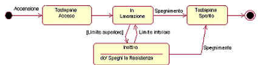
  <figcaption class="fig-caption">Esempio di State Diagram per il controllo di un tostapane</figcaption>
</figure>

## Sequence Diagram

<figure class="fig-float right" style="width: 35%;">
  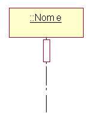
  <figcaption class="fig-caption">Esempio di Sequence Diagram</figcaption>
</figure>

Il **Sequence Diagram** (Diagramma di Sequenza), in maniera duale rispetto allo State Diagram che si focalizza sugli stati, evidenzia l'ordinamento temporale e sequenziale con cui gli oggetti e i componenti interagiscono tra loro per portare a termine un determinato processo o caso d'uso. Viene utilizzato principalmente per visualizzare flussi di lavoro complessi, permettendo al team di comprendere il comportamento dinamico del sistema senza dover analizzare direttamente il codice sorgente. 

È uno strumento chiave nella progettazione dell'architettura software (specialmente nei sistemi distribuiti o orientati ai servizi), nella documentazione dei flussi a beneficio degli sviluppatori e nelle attività di debugging, poiché aiuta a individuare colli di bottiglia o asincronie errate nella sequenza delle comunicazioni.

La struttura si sviluppa attorno a componenti chiave che operano su una linea temporale verticale:
* **Partecipanti (Attori e Linee di vita)**: gli attori rappresentano i ruoli esterni al sistema (es. utenti umani), mentre le linee di vita (*lifelines*), rappresentate da rettangoli con una linea tratteggiata verticale, indicano gli oggetti interni che partecipano all'interazione.
* **Barre di Attivazione (Activation Bars)**: rettangoli verticali sovrapposti alle lifelines che indicano il periodo di tempo in cui un oggetto è attivo o in esecuzione per farsi carico di un'operazione.
* **Messaggi**: frecce orizzontali orientate che collegano le linee di vita per mostrare lo scambio di informazioni o l'invocazione di metodi.

Un messaggio viaggia dalla lifeline dell'oggetto mittente fino alla lifeline del destinatario. Quando un oggetto invia un messaggio a se stesso per eseguire un metodo interno, la freccia si ripiega sulla lifeline stessa, configurando un'operazione di **Autoriferimento** (o *Self-Message*).

Le principali specifiche grafiche dei messaggi in UML sono:
* **Messaggio Sincrono**: rappresentato da una freccia con punta piena ($\rightarrow$). Il mittente invia il messaggio e blocca la propria esecuzione in attesa di una risposta (rappresentata da una freccia tratteggiata di ritorno $\dashrightarrow$) prima di poter continuare.
* **Messaggio Asincrono**: rappresentato da una freccia con punta aperta ($\rightarrow$). Il mittente invia il messaggio e continua la sua esecuzione immediatamente, senza attendere che il destinatario abbia completato l'operazione.

<figure class="fig-float center" style="width: 70%;">
  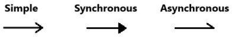
  <figcaption class="fig-caption">Rappresentazione grafica dei messaggi in UML</figcaption>
</figure>

L'asse verticale del diagramma rappresenta rigorosamente il **trascorrere del tempo** dall'alto verso il basso. Pertanto, un messaggio collocato geometricamente più in alto rispetto a un altro si verificherà cronologicamente prima. Spesso l'interazione viene avviata da un attore esterno posto all'inizio della sequenza temporale.

<figure class="fig-float center" style="width: 60%;">
  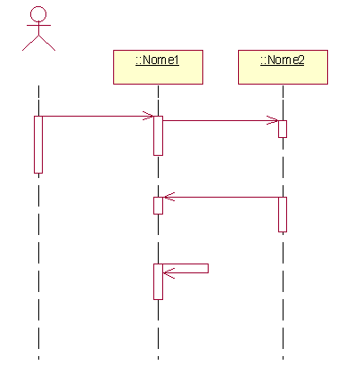
  <figcaption class="fig-caption">Flusso temporale e attivazione degli oggetti</figcaption>
</figure>

In modo analogo a quanto avviene nella programmazione, intere sequenze di messaggi possono essere raggruppate in blocchi logici chiamati **Frammenti Combinati (Combined Fragments)**. Questi blocchi permettono di modellare costrutti condizionali (come gli *if-else* tramite l'operatore `alt`) o cicli iterativi (tramite l'operatore `loop`). Inoltre, condizioni logiche racchiuse tra parentesi quadre (condizioni di guardia) possono essere associate ai singoli messaggi per specificare che l'invocazione avviene solo se il requisito è soddisfatto.

Per illustrare il flusso logico delle interazioni, consideriamo lo scenario di acquisto di un prodotto da una macchina self-service, mappando lo scambio di messaggi tra tre componenti chiave del sistema: la **Parte Frontale** (interfaccia utente), la **Cassetta delle Monete** (logica di controllo e cassa) e il **Contenitore dei Prodotti** (magazzino fisico).

Il flusso logico delle operazioni si sviluppa secondo la seguente sequenza temporale:
1. Il cliente inserisce le monete tramite la Parte Frontale della macchina.
2. Il cliente esegue la selezione del prodotto desiderato sulla stessa interfaccia.
3. I dati sul pagamento vengono inoltrati alla Cassetta delle Monete.
4. Il modulo di controllo della Cassetta delle Monete interroga il Contenitore dei Prodotti per verificarne la disponibilità fisica.
5. La Cassetta delle Monete aggiorna internamente il proprio bilancio e la riserva di resto.
6. Una volta convalidato il pagamento e la disponibilità, la Cassetta delle Monete comanda al Contenitore dei Prodotti di erogare l'alimento, che viene infine prelevato dall'utente tramite la Parte Frontale.

<figure class="fig-float center" style="width: 80%;">
  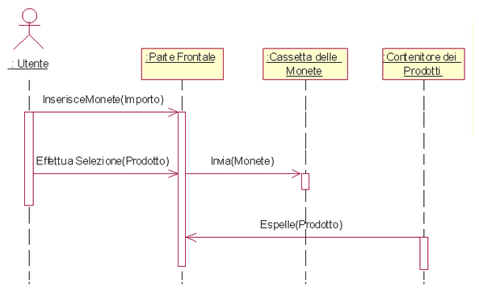
  <figcaption class="fig-caption">Sequence Diagram per il processo di acquisto self-service</figcaption>
</figure>

## Communication Diagram

Il **Communication Diagram** (noto in UML 1.x come *Collaboration Diagram*) mostra, in modo analogo al Sequence Diagram, come gli oggetti interagiscono tra loro per portare a termine un compito specifico o un caso d'uso. Pur trasmettendo le stesse informazioni logiche del diagramma di sequenza, si differenzia da quest'ultimo perché mette in secondo piano la linea temporale pura per focalizzarsi principalmente sull'organizzazione spaziale, sull'architettura e sulle relazioni strutturali tra gli oggetti.

Trova la sua utilità principale nell'analisi dei requisiti e nella visualizzazione dei meccanismi strutturali che compongono il design di un sistema. Viene impiegato per mappare scenari complessi che coinvolgono elementi interconnessi, aiutando i progettisti a identificare chiaramente quali oggetti partecipano a una determinata funzionalità. Inoltre, data la sua natura compatta che ottimizza lo spazio bidimensionale, viene spesso usato come alternativa al diagramma di sequenza, nel quale può essere convertito in modo diretto ed equivalente.

Il diagramma viene realizzato inserendo sui collegamenti strutturali delle frecce che indicano il verso in cui il messaggio viene inviato, corredate da etichette (*labels*) che ne esplicitano il contenuto e l'ordine di esecuzione.

<figure class="fig-float center" style="width: 70%;">
  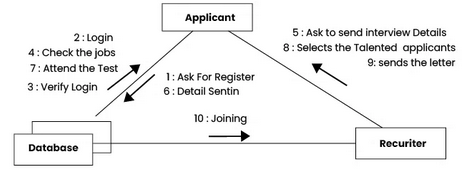
  <figcaption class="fig-caption">Sintassi di base di un Communication Diagram</figcaption>
</figure>

Nella seguente figura sono mostrate alcune peculiarità grafiche di questo modello: nel caso in cui si debba rappresentare un insieme di oggetti multipli (una collezione) viene impiegata una visualizzazione a fogli sovrapposti (*stack*), mentre per i risultati restituiti da un'operazione o per l'assegnazione di valori si usa la notazione con il simbolo `:=`.

<figure class="fig-float center" style="width: 70%;">
  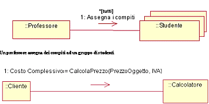
  <figcaption class="fig-caption">Notazioni avanzate per oggetti multipli e valori di ritorno</figcaption>
</figure>

La struttura si sviluppa come una rete di elementi interconnessi, definita da quattro componenti principali:
* **Oggetti e Attori**: gli attori avviano l'interazione dall'esterno, mentre gli oggetti sono i componenti interni (rappresentati con la sintassi `nomeOggetto : NomeClasse` racchiusa in un rettangolo e interamente sottolineata) che ricevono ed eseguono le operazioni.
* **Collegamenti (Links)**: linee continue che uniscono attori e oggetti, o gli oggetti tra loro. Rappresentano le istanze delle relazioni (associazioni) attraverso cui è consentito il passaggio dei messaggi.
* **Messaggi e Direzione**: frecce posizionate accanto ai collegamenti che indicano la direzione della comunicazione (da chi invoca a chi esegue).
* **Numerazione di Sequenza**: l'ordine temporale delle azioni viene gestito inserendo un numero progressivo prima di ogni messaggio. Si utilizza una notazione gerarchica decimale (es. `1`, `1.1`, `1.2`) per mappare i messaggi nidificati che avvengono all'interno dello stesso flusso o a seguito di una specifica chiamata principale.

Per comprendere la gestione dei flussi logici, si consideri nuovamente il sistema della macchina self-service. 

Nel flusso principale (scenario ideale):
1. Il cliente inserisce le monete.
2. Il cliente seleziona il prodotto desiderato.
3. La macchina controlla che l’importo sia corretto e che il prodotto sia disponibile in magazzino.
4. Se le verifiche sono positive, il sistema comanda l'espulsione del prodotto, che il cliente può infine prelevare.

I Communication Diagram sono particolarmente efficaci nel mostrare graficamente la gestione dei **flussi alternativi o anomali** direttamente sulle stesse linee di collegamento, applicando condizioni di guardia condizionali:
* **Importo insufficiente**: il sistema segnala l’ammontare mancante e resta in attesa del completamento del pagamento.
* **Prodotto esaurito**: la macchina informa l’utente tramite il display e offre la possibilità di selezionare un codice alternativo oppure di richiedere il rimborso totale.
* **Mancanza di resto**: la macchina visualizza un avviso, restituisce l’importo inserito e invita a inserire la cifra esatta.

Il diagramma di comunicazione tiene conto di tutte queste ramificazioni utilizzando espressioni condizionali poste tra parentesi quadre (es. `[prodotto presente]`) associate alla numerazione progressiva, rendendo evidenti le decisioni e i percorsi logici intrapresi dai vari moduli del sistema.

<figure class="fig-float center" style="width: 80%;">
  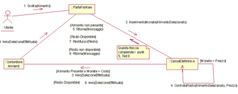
  <figcaption class="fig-caption">Communication Diagram completo per il sistema self-service</figcaption>
</figure>

