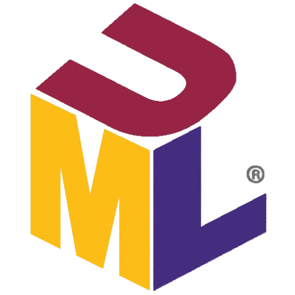
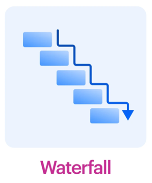
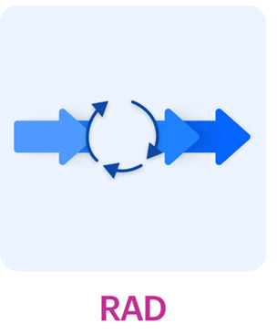

# Fondamenti di UML

## Modellazione Visiva del Software e Contesto Storico

<figure class="fig-float right" style="width: 35%;">
  
  <figcaption class="fig-caption">UML</figcaption>
</figure>

**UML** (**Unified Modeling Language**) è un linguaggio grafico e visivo standardizzato che, attraverso una serie di diagrammi, permette di analizzare, visualizzare e documentare i componenti di sistemi software (e non solo), anche ad alta complessità. Risponde dunque alla necessità di ricercare un linguaggio standardizzato per descrivere le parti di un progetto, tendenzialmente software, orientato agli oggetti, che sia comprensibile sia dai tecnici sia dai non addetti ai lavori.

<figure class="fig-float right" style="width: 35%;">
  
  <figcaption class="fig-caption">Waterfall</figcaption>
</figure>

Prima di entrare nel merito delle caratteristiche specifiche del linguaggio, è fondamentale approfondire il contesto storico che ne ha determinato la nascita e la successiva diffusione. Tra gli anni '60 e '70 si assiste all'evoluzione della programmazione orientata agli oggetti (OOP), la quale introduce nell'ingegneria del software i concetti cardine di classe, oggetto, astrazione, incapsulamento, ereditarietà e polimorfismo. In quel periodo, l'approccio standard per l'analisi e la progettazione era il modello **Waterfall** (a cascata), un processo sequenziale rigido basato su fasi temporali strettamente propedeutiche e separate. 

Con il progressivo aumento della complessità dei sistemi, il Waterfall iniziò presto a mostrare limiti strutturali evidenti: una marcata rigidità davanti ai cambiamenti, forti barriere comunicative tra i team di analisti e progettisti e, soprattutto, l'assenza di un linguaggio visivo comune. In risposta a questa crisi metodologica si consolidò il **Visual Modeling**, un approccio progettuale basato sulla rappresentazione dei sistemi complessi mediante modelli visivi e diagrammi condivisi, concepiti per far comunicare efficacemente tutti i membri del team. Questo aspetto gioca un ruolo chiave nell'industria moderna, dove la complessità dei sistemi richiede la convergenza di figure altamente specializzate: il *cliente*, che definisce il dominio del problema; l’*analista*, che traduce le richieste in specifiche tecniche; i *disegnatori/architetti*, che delineano i modelli strutturali; e gli *sviluppatori*, impegnati nell'implementazione e nel testing del codice. Il Visual Modeling promuove un'interazione continua tra queste figure, migliorando la condivisione della conoscenza e assicurando che il prodotto finale rispecchi pienamente le esigenze del business.

Se da un lato il Visual Modeling offriva la filosofia collaborativa su come impostare l'architettura del software, dall'altro mancava ancora un tassello fondamentale: uno standard espressivo universale. Poiché ogni team di sviluppo tendeva a utilizzare simbologie e notazioni proprietarie, nacque l'esigenza stringente di uniformare la rappresentazione dei componenti software. Con queste premesse, a metà degli anni '90, tre noti ingegneri del software — Grady Booch, Ivar Jacobson e James Rumbaugh (storicamente noti come *The Three Amigos*) — unificarono i propri approcci metodologici dando vita all'UML.

L'introduzione di questo standard all'interno dei processi industriali porta con sé significativi vantaggi:
* **Pianificazione Anticipata**: la redazione dei diagrammi prima dello sviluppo effettivo permette di formalizzare l'architettura logica, offrendo fin dal principio una visione d'insieme chiara del risultato finale.
* **Modularità e Riutilizzo**: le funzionalità strutturate in modo astratto all'interno di un diagramma possono essere isolate e reimpiegate più agevolmente come modelli di riferimento in altri progetti.
* **Isolamento precoce degli errori**: la schematizzazione visiva rende più semplice prevedere lacune logiche, bug strutturali o inconsistenze di flusso prima della scrittura del codice.
* **Inclusività dei non Tecnici**: il beneficio più importante è la capacità di tradurre concetti informatici complessi in schemi accessibili ai non sviluppatori, consentendo loro di comprendere l'architettura e partecipare attivamente alle decisioni di progetto.

Tuttavia, sebbene UML sia nato per semplificare la progettazione di sistemi complessi, la sua applicazione pratica ha evidenziato diverse criticità operative. Una prima difficoltà riguarda la **manutenzione dei diagrammi**: i tool di gestione grafica spesso non sono integrati nativamente con il codice sorgente, per cui la modifica dell'uno non comporta l'aggiornamento automatico dell'altro. Questo disaccoppiamento ostacola sensibilmente la gestione delle varianti in corso d'opera. Un ulteriore fattore di complicazione investe l'ambito comunicativo: l'estrema flessibilità di UML conduce talvolta a interpretazioni soggettive e malintesi, mentre l'eccessiva densità di dettagli grafici rischia di distogliere l'attenzione dalle scelte architetturali cruciali. 

Questi problemi vengono inaspriti in presenza di scadenze stringenti, requisiti fluidi o all'interno di team di piccole dimensioni, contesti in cui l'onere di manutenzione di UML può trasformarsi in un ostacolo burocratico. In molti scenari si assiste a un totale disallineamento tra il codice e i modelli, i quali degradano a disegni isolati del progetto iniziale, privi di legami reali con il software in produzione. Per tali ragioni, l'industria moderna si sta orientando verso strumenti e metodologie più agili (*Agile Modeling*), capaci di promuovere una comunicazione più snella e adatta ai ritmi dello sviluppo contemporaneo.

## L'Evoluzione in UML 2.0 e Domini d'Applicazione

La comprensione delle regole sintattiche e strutturali dei diagrammi moderni richiede una breve analisi della profonda revisione che lo standard ha subito con l'introduzione di **UML 2.0**. Rilasciata a metà degli anni 2000 dall'OMG (*Object Management Group*), questa specifica non ha rappresentato un semplice aggiornamento incrementale, ma una vera e propria ristrutturazione architetturale mirata a colmare le ambiguità semantiche della versione 1.x e a supportare la modellazione di sistemi enterprise su larga scala.

I cambiamenti e le innovazioni introdotte da UML 2.0 si articolano principalmente su quattro pilastri fondamentali:

* **Rigore Semantico e Metamodellazione**: lo standard è stato diviso nettamente in due parti: l'*Infrastruttura* (che definisce i concetti interni e i costrutti core di metamodellazione) e la *Superstruttura* (che definisce la notazione dei diagrammi utilizzati dagli utenti). Questo rigore ha ridotto le interpretazioni arbitrarie, gettando le basi per l'ingegneria guidata dai modelli (*Model-Driven Architecture* - MDA) e permettendo ai software di CASE (*Computer-Aided Software Engineering*) di convertire i diagrammi in codice sorgente senza ambiguità.
* **Nuova Classificazione dei Diagrammi**: lo standard ha esteso e riorganizzato il proprio catalogo, portando il numero dei diagrammi ufficiali a 13 (successivamente ridefiniti nelle sotto-versioni). È stata formalizzata la macro-distinzione tra **Diagrammi Strutturali** (focalizzati sugli aspetti statici del sistema, come il *Class* o il *Deployment Diagram*) e **Diagrammi Comportamentali** (focalizzati sulle dinamiche e sulle interazioni a runtime, come l'*Activity* o il *Sequence Diagram*).
* **Introduzione dei Frammenti Combinati (*Combined Fragments*)**: per incrementare l'espressività dei modelli temporali, nel *Sequence Diagram* sono stati introdotti i blocchi logici strutturati dotati di operatori dedicati (es. `alt` per i costrutti condizionali, `loop` per i cicli iterativi, `par` per le interazioni parallele). Questa innovazione ha eliminato le ramificazioni caotiche e disorganizzate tipiche delle versioni precedenti, avvicinando la modellazione visuale alle strutture della programmazione strutturata.
* **Modellazione a Componenti e Strutture Composite**: UML 2.0 ha rivoluzionato il modo di descrivere i sistemi modulari introducendo i concetti di porte (*ports*), connettori e strutture composite. Questo consente di incapsulare i componenti software in scatole nere (*black-boxes*) e di definire con precisione geometrica i punti di contatto attraverso cui l'elemento espone o richiede servizi tramite le interfacce, migliorando l'analisi delle architetture a servizi (SOA) e dei sistemi distribuiti.

Nonostante i limiti metodologici, UML rimane uno strumento efficace in domini specifici grazie alla sua capacità di estensione tramite i profili e i meccanismi di stereotipazione. Tra i settori in cui l'uso di UML è più fiorente figurano:
* **Applicazioni Web (Web Engineering)**: le applicazioni web sono sistemi a forte intensità di software. UML viene impiopagato per modellarne l'interfaccia utente, la struttura logica e i flussi dinamici (lato client e lato server) attraverso un approccio Model-Driven. Si utilizzano, ad esempio, i diagrammi dei casi d'uso per definire le funzionalità utente e i diagrammi di deployment per mappe l'architettura tecnica e la distribuzione sui server.
* **Sistemi Embedded e Real-Time**: nel design di sistemi embedded, l'analisi dei requisiti funzionali e la specifica del software sono passaggi critici. UML supporta lo sviluppo di questi flussi integrando il comportamento del sistema con i fattori ambientali esterni. In questo tipo di sistemi sono molto utilizzati i diagrammi di stato per modellare il comportamento reattivo dell'hardware e del software. È inoltre da notare che è stato definito il Profilo MARTE (Modeling and Analysis of Real-Time and Embedded Systems), ovvero un'estensione standardizzata di UML progettata specificamente per supportare le specifiche di dominio, le prestazioni e l'analisi dei vincoli temporali.

## Rapid Application Development

<figure class="fig-float right" style="width: 35%;">
  
  <figcaption class="fig-caption">RAD</figcaption>
</figure>

Il **RAD** (**Rapid Application Development**) è l'iter tecnico-logico volto allo sviluppo in tempi brevi di software di alta qualità attraverso l'impiego strategico di UML. Esso è composto da cinque fasi:
1. **Raccolta delle informazioni**: in questa fase, gli analisti studiano i processi aziendali del cliente tramite colloqui dettagliati, analizzandoli passo dopo passo e rappresentandoli graficamente con gli <u>Activity Diagram</u>. Successivamente, durante l'analisi del dominio, si identificano le entità principali e i termini chiave del sistema, classificandoli come possibili classi, attributi o operazioni. Questa attività culmina nella creazione di un <u>Class Diagram</u> preliminare. Il team procede poi con l'identificazione delle dipendenze tra il nuovo sistema e le infrastrutture preesistenti, un'attività svolta da un System Engineer e rappresentata tramite un <u>Deployment Diagram</u>. In una sessione collaborativa JAD (*Joint Application Design*), che coinvolge il cliente, i potenziali utenti e il team di sviluppo, si definiscono i requisiti finali, aggiornando ulteriormente il Class Diagram. Infine, il Project Manager presenta al cliente i risultati dell'analisi, supportato dai diagrammi creati, per consolidare una comprensione condivisa del progetto e delle sue specifiche.
2. **Analisi**: una volta ottenute tutte le informazioni lato cliente, a questo punto è necessario approfondire il problema e fornire una prima struttura formale del Class Diagram. In una sessione JAD, il team di sviluppo lavora con i potenziali utenti per comprendere i possibili scenari d'uso del software. Per questo motivo vengono generati gli <u>Use Case Diagram</u>. Durante la creazione dei modelli, è fondamentale porre attenzione alla descrizione di eventuali cambi di stato di un oggetto, laddove necessario; in questa fase vengono quindi prodotti gli <u>State Diagram</u>. I progettisti si occuperanno inoltre della stesura dei <u>Sequence Diagram</u> e dei <u>Collaboration Diagram</u> per descrivere le interazioni dinamiche a runtime.
3. **Disegno (Progettazione)**: durante questa fase, i disegnatori e gli analisti devono aggiornarsi continuamente, poiché lo scopo è delineare l'architettura dettagliata del sistema sviluppando e rifinendo i diversi diagrammi prodotti in precedenza. In questo momento si avvia ufficialmente la documentazione tecnica del progetto.
4. **Sviluppo**: basandosi sui dettagli espressi nei Class, Object e Activity Diagram, i programmatori possono implementare effettivamente il codice sorgente del sistema. Ogni nuova implementazione deve essere associata a una fase di test. Molto spesso in questa fase si rende necessario sviluppare anche la GUI (interfaccia grafica) con cui l'utente interagirà. Tutta l'attività è corredata da un'accurata documentazione del codice.
5. **Deployment**: al termine dello sviluppo, il sistema viene installato sull'hardware appropriato e integrato con le piattaforme esterne con cui deve interagire. A questo punto si testa il sistema nel suo complesso e, a seconda dei risultati del collaudo, si decide se rilasciare il prodotto o avviare un'ulteriore fase di raffinamento iterativo.

## Strumenti Software per la Modellazione UML

L'applicazione pratica del processo RAD e la stesura dei diagrammi previsti dallo standard richiedono l'utilizzo di strumenti digitali dedicati che superino i limiti fisici della modellazione su carta, favorendo la condivisione in tempo reale e la manutenzione dei modelli architetturali. Di seguito sono analizzati i software più diffusi nell'industria contemporanea per la creazione di diagrammi UML, classificati in base al loro approccio operativo e al target di riferimento:

* **Lucidchart**: strumento Cloud basato su HTML5 con interfaccia *drag-and-drop*, ideale anche per figure non prettamente tecniche. Eccelle nella collaborazione in tempo reale e si integra nativamente con ecosistemi aziendali come Slack, MS Teams e G Suite, offrendo un supporto completo per diagrammi delle classi, di sequenza e di attività.
* **Gleek.io**: si differenzia radicalmente dagli altri strumenti poiché adotta una filosofia basata sul codice (*Diagram-as-Code*). Non prevede il *drag-and-drop* ma sfrutta esclusivamente comandi da tastiera e una sintassi testuale proprietaria con auto-completamento integrato, risultando estremamente rapido per sviluppatori che devono tracciare diagrammi di sequenza, classi e oggetti.
* **Diagrams.net (ex Draw.io)**: una delle alternative open-source e gratuite più celebri del mercato. Dotato di un'interfaccia *drag-and-drop* semplice e intuitiva, è lo strumento ideale per la stesura rapida di diagrammi di casi d'uso, attività e sequenza, sebbene presenti meno funzionalità di automazione avanzata rispetto a tool commerciali complessi.
* **Cacoo**: piattaforma focalizzata sull'usabilità immediata e sulla collaborazione visuale sincrona all'interno dei team di design. Permette di generare rapidamente diagrammi logici e di flusso senza richiedere competenze sintattiche UML avanzate, risultando ottimale per sessioni di brainstorming ma talvolta limitato per modellazioni enterprise rigorose.
* **Gliffy**: opera come una lavagna virtuale integrata, ricca di template geometrici e temi predefiniti basati su logiche *drag-and-drop*. È progettato specificamente per team che necessitano di una curva di apprendimento minima, supportando efficacemente diagrammi dei pacchetti, di struttura composta e dei componenti.
* **EdrawMax**: software professionale dotato di un'interfaccia ricca in stile Microsoft Office. Eccelle nelle funzionalità di esportazione multipiattaforma (PDF, HTML, Word, PowerPoint) e supporta un'ampia varietà di schemi avanzati, inclusi i diagrammi di panoramica di interazione e dei componenti.
* **Microsoft Visio Pro**: lo standard *de facto* nelle grandi realtà aziendali completamente integrate nell'ecosistema Microsoft. Basato su potenti funzionalità *drag-and-drop* e stencil certificati, consente di incorporare i diagrammi UML di base (stato, casi d'uso, attività) direttamente all'interno dei flussi di lavoro e della documentazione di livello enterprise.